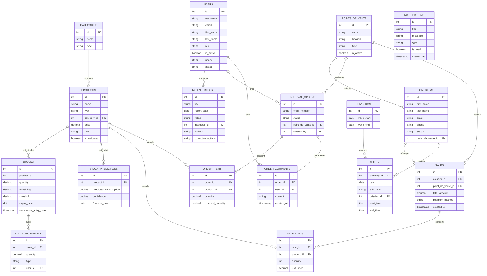

# CONCEPTION DE LA BASE DE DONNÉES (MODÈLE CONCEPTUEL & PHYSIQUE)

Ce document présente la modélisation conceptuelle et physique de la base de données de l'application **AeroServe**, rédigée dans un format académique adapté pour l'intégration directe dans un rapport de **Projet de Fin d'Études (PFE)**.

---

## 1. Dictionnaire des Données & Structure des Tables

La base de données d'AeroServe est structurée sous forme relationnelle (SQL). Elle assure la cohérence des opérations entre la gestion des stocks (FIFO), les ventes des caisses, les plannings et les contrôles d'hygiène.

### A. Utilisateurs & Profils (`users`)
Cette table stocke les comptes des employés et détermine leurs habilitations via un système de rôles (RBAC).
* **Clé Primaire** : `id`
* **Structure** :
  | Attribut | Type | Description |
  | :--- | :--- | :--- |
  | `id` | INT (PK) | Identifiant unique de l'utilisateur. |
  | `username` | VARCHAR(191) | Nom d'utilisateur unique pour la connexion. |
  | `email` | VARCHAR(191) | Adresse email professionnelle unique. |
  | `first_name` | VARCHAR(100) | Prénom de l'employé. |
  | `last_name` | VARCHAR(100) | Nom de famille de l'employé. |
  | `role` | ENUM | Rôle applicatif (`SUPER_ADMIN`, `RESPONSABLE_FB`, `CHEF_CUISINE`, `CHEF_MAGASIN`, `RESPONSABLE_ACHAT`, `RESPONSABLE_HYGIENE`, `CAISSIER`). |
  | `is_active` | BOOLEAN | Statut d'activation du compte (actif/inactif). |
  | `phone` | VARCHAR(20) | Numéro de téléphone (optionnel). |
  | `avatar` | VARCHAR(255) | Chemin de l'image de profil sur le serveur. |

---

### B. Catégories (`categories`) & Produits (`products`)
Ces tables définissent les articles gérés dans le système (matières premières, produits finis, marchandises).
* **Table `categories`** :
  | Attribut | Type | Description |
  | :--- | :--- | :--- |
  | `id` | INT (PK) | Identifiant unique de la catégorie. |
  | `name` | VARCHAR(100) | Nom de la catégorie (ex: Boissons, Ingrédients). |
  | `type` | ENUM | Segment du produit (`FOOD`, `COMMERCIAL`, `RAW_MATERIAL`). |

* **Table `products`** :
  | Attribut | Type | Description |
  | :--- | :--- | :--- |
  | `id` | INT (PK) | Identifiant unique du produit. |
  | `name` | VARCHAR(191) | Nom complet du produit. |
  | `type` | ENUM | Catégorisation technique (`FOOD`, `COMMERCIAL`, `RAW_MATERIAL`). |
  | `category_id` | INT (FK) | Référence vers la catégorie associée. |
  | `price` | DECIMAL(10,2) | Prix unitaire en Dinars Tunisiens (TND). |
  | `unit` | VARCHAR(50) | Unité de mesure par défaut (pièce, kg, litre). |
  | `is_validated`| BOOLEAN | Indique si le produit a été validé par le Responsable Achat. |

---

### C. Stocks (`stocks`) & Mouvements de Stock (`stock_movements`)
Ces tables gèrent le niveau réel des stocks en entrepôt en appliquant la méthode d'évaluation **FIFO (First In, First Out)**.
* **Table `stocks`** :
  | Attribut | Type | Description |
  | :--- | :--- | :--- |
  | `id` | INT (PK) | Identifiant de la strate de stock. |
  | `product_id` | INT (FK) | Référence vers le produit en stock. |
  | `quantity` | DECIMAL(10,2) | Quantité initiale de la strate de stock entrée. |
  | `remaining` | DECIMAL(10,2) | Quantité restante (utilisée pour le calcul FIFO). |
  | `threshold` | DECIMAL(10,2) | Seuil d'alerte pour le réapprovisionnement. |
  | `expiry_date`| DATE | Date de péremption du lot (optionnelle). |
  | `warehouse_entry_date` | TIMESTAMP | Date précise d'entrée en entrepôt. |

* **Table `stock_movements`** :
  | Attribut | Type | Description |
  | :--- | :--- | :--- |
  | `id` | INT (PK) | Identifiant unique du mouvement. |
  | `stock_id` | INT (FK) | Référence vers la strate de stock concernée. |
  | `quantity` | DECIMAL(10,2) | Quantité mouvementée. |
  | `type` | ENUM | Sens du mouvement (`entrée` / `sortie`). |
  | `user_id` | INT (FK) | Référence vers l'utilisateur ayant saisi le mouvement. |

---

### D. Points de Vente (`points_de_vente`) & Caissiers (`caissiers`)
Ces tables gèrent la structure géographique des différents points de vente au sein de l'aéroport.
* **Table `points_de_vente`** :
  | Attribut | Type | Description |
  | :--- | :--- | :--- |
  | `id` | INT (PK) | Identifiant unique du point de vente. |
  | `name` | VARCHAR(100) | Nom du restaurant/café/boutique dans l'aéroport. |
  | `location` | VARCHAR(255) | Emplacement physique précis. |
  | `type` | ENUM | Zone aéroportuaire (`airside` sous douane / `landside` zone publique). |
  | `is_active` | BOOLEAN | Statut d'ouverture ou d'activité de la boutique. |

* **Table `caissiers`** :
  | Attribut | Type | Description |
  | :--- | :--- | :--- |
  | `id` | INT (PK) | Identifiant du caissier. |
  | `first_name` | VARCHAR(100) | Prénom. |
  | `last_name` | VARCHAR(100) | Nom de famille. |
  | `email` | VARCHAR(191) | Email du caissier. |
  | `phone` | VARCHAR(20) | Numéro de téléphone. |
  | `status` | ENUM | Statut d'affectation (`en_attente`, `active`, `inactive`). |
  | `point_de_vente_id` | INT (FK) | Référence vers le point de vente d'affectation par défaut. |

---

### E. Ventes (`sales`) & Lignes de Ventes (`sale_items`)
Elles modélisent les transactions financières réalisées aux caisses de l'aéroport.
* **Table `sales`** :
  | Attribut | Type | Description |
  | :--- | :--- | :--- |
  | `id` | INT (PK) | Identifiant unique de la transaction. |
  | `caissier_id` | INT (FK) | Référence vers le caissier ayant enregistré la vente. |
  | `point_de_vente_id` | INT (FK) | Référence vers le point de vente associé. |
  | `total_amount` | DECIMAL(10,2) | Montant total payé par le client. |
  | `payment_method` | VARCHAR(50) | Méthode de paiement (Cash, Carte Bleue, etc.). |
  | `created_at` | TIMESTAMP | Date et heure de la vente. |

* **Table `sale_items`** :
  | Attribut | Type | Description |
  | :--- | :--- | :--- |
  | `id` | INT (PK) | Identifiant de la ligne de vente. |
  | `sale_id` | INT (FK) | Référence vers la transaction mère. |
  | `product_id` | INT (FK) | Référence vers le produit vendu. |
  | `quantity` | INT | Nombre d'unités vendues. |
  | `unit_price` | DECIMAL(10,2) | Prix unitaire facturé lors de la transaction. |

---

### F. Commandes Internes (`internal_orders`) & Lignes de Commandes (`order_items`)
Gèrent le flux de réapprovisionnement des points de vente à partir du stock central.
* **Table `internal_orders`** :
  | Attribut | Type | Description |
  | :--- | :--- | :--- |
  | `id` | INT (PK) | Identifiant de la commande. |
  | `order_number` | VARCHAR(100) | Numéro de suivi de commande unique. |
  | `status` | ENUM | Étape de livraison (`brouillon`, `validé`, `en_cours`, `préparé`, `livré`, `facturé`). |
  | `point_de_vente_id` | INT (FK) | Référence vers le point de vente demandeur. |
  | `created_by` | INT (FK) | Référence vers l'utilisateur créateur du bon de commande. |

* **Table `order_items`** :
  | Attribut | Type | Description |
  | :--- | :--- | :--- |
  | `id` | INT (PK) | Identifiant unique de la ligne. |
  | `order_id` | INT (FK) | Référence vers la commande interne parente. |
  | `product_id` | INT (FK) | Référence vers le produit demandé. |
  | `quantity` | DECIMAL(10,2) | Quantité commandée initialement. |
  | `received_quantity` | DECIMAL(10,2) | Quantité effectivement reçue après livraison. |

---

### G. Plannings (`plannings`) & Shifts de Travail (`shifts`)
Ces tables permettent la planification des noptions de garde et de travail hebdomadaires des caissiers.
* **Table `plannings`** :
  | Attribut | Type | Description |
  | :--- | :--- | :--- |
  | `id` | INT (PK) | Identifiant de la semaine planifiée. |
  | `week_start` | DATE | Date de début de semaine (Lundi). |
  | `week_end` | DATE | Date de fin de semaine (Dimanche). |

* **Table `shifts`** :
  | Attribut | Type | Description |
  | :--- | :--- | :--- |
  | `id` | INT (PK) | Identifiant de la garde/shift. |
  | `planning_id` | INT (FK) | Référence vers le planning hebdomadaire associé. |
  | `day` | DATE | Date exacte de la garde. |
  | `shift_type` | ENUM | Type de shift (`Matin`, `Après-midi`, `Nuit`). |
  | `caissier_id` | INT (FK) | Référence vers le caissier affecté à ce shift. |
  | `start_time` | TIME | Heure de début de prise de poste. |
  | `end_time` | TIME | Heure de fin de poste. |

---

### H. Rapports d'Hygiène (`hygiene_reports`)
Permet au Responsable Hygiène de soumettre des audits et contrôles de sécurité sanitaire sur les produits ou installations.
| Attribut | Type | Description |
| :--- | :--- | :--- |
| `id` | INT (PK) | Identifiant unique du rapport. |
| `title` | VARCHAR(191) | Titre de l'audit ou inspection. |
| `report_date`| DATE | Date de l'audit. |
| `rating` | ENUM | Note finale sur la conformité de l'hygiène (`A`, `B`, `C`, `D`). |
| `inspector_id`| INT (FK) | Référence vers l'inspecteur d'hygiène (User). |
| `findings` | TEXT | Constats observés sur le terrain (optionnel). |
| `corrective_actions` | TEXT | Actions correctives imposées (optionnel). |

---

### I. Teneurs de Prédictions de Stock (`stock_predictions`)
Stocke les prévisions de consommation générées par le module d'intelligence artificielle de l'application.
| Attribut | Type | Description |
| :--- | :--- | :--- |
| `id` | INT (PK) | Identifiant unique de la prédiction. |
| `product_id` | INT (FK) | Référence vers le produit analysé. |
| `predicted_consumption` | DECIMAL(10,2) | Volume de consommation estimé par l'IA. |
| `confidence` | DECIMAL(5,2) | Pourcentage de précision ou de certitude de la prévision. |
| `forecast_date`| DATE | Date ciblée par la prédiction. |

---

## 2. Diagramme Relationnel des Données (Modèle Physique - ERD)

Le diagramme entité-association ci-dessous illustre l'ensemble des tables SQL de la base de données AeroServe ainsi que la cardinalité de leurs relations.

---

## 3. Règles de Gestion & Intégrité Référentielle (Business Rules)

Afin de garantir la cohérence des données stockées dans le système, plusieurs contraintes d'intégrité sont implémentées au niveau de la base de données :

1. **Intégrité de Domaine (Contraintes de Clé)** :
   * Chaque table possède une clé primaire unique (`PK`) en auto-incrémentation.
   * L'unicité des adresses mails (`users.email` et `caissiers.email`) et des numéros de commande (`internal_orders.order_number`) est renforcée par des contraintes uniques (`UNIQUE`).

2. **Intégrité Référentielle (Clés Étrangères)** :
   * La suppression d'un produit (`products`) est bloquée s'il existe des transactions de vente associées (`sale_items`), ou s'il fait partie d'une strate de stock en cours (`stocks`) afin d'éviter les orphelins de données (`ON DELETE RESTRICT`).
   * Les relations d'historique de mouvements (`stock_movements`) préservent les identifiants d'utilisateurs (`ON DELETE SET NULL`) en cas de suppression de compte pour conserver la traçabilité des stocks.

3. **Validation FIFO (First In, First Out)** :
   * La table `stocks` maintient une colonne `remaining`. Lors d'une transaction de sortie, l'algorithme SQL/Backend récupère la ligne de stock la plus ancienne (`warehouse_entry_date` minimale) dont la quantité `remaining > 0` et décrémente celle-ci jusqu'à épuisement avant de passer au lot de stock suivant.
