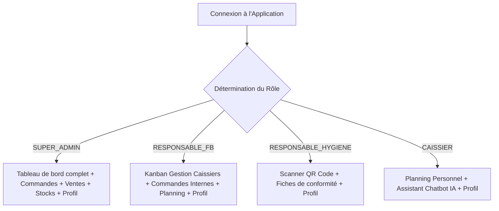

# Rapport Complet de l'Application Mobile AeroServe (Flutter)
## Guide d'Utilisation, Rôles et Configuration de Connexion

Ce document présente un guide complet et détaillé destiné à votre client final concernant l'**application mobile companion AeroServe**. Ce guide explique les rôles autorisés, les fonctionnalités disponibles pour chaque type de compte, l'architecture de communication et la procédure pas à pas pour connecter et tester l'application avec le serveur de développement.

---

## 1. Profils et Rôles Autorisés (Sécurisation des Accès)

Pour des raisons évidentes de sécurité et de confidentialité des données, l'accès à l'application mobile est restreint via une **liste blanche (Whitelist)** de rôles autorisés. 

Les profils suivants sont autorisés à se connecter sur mobile :
1. **SUPER_ADMIN (Super Administrateur)** : Pour le contrôle global, le suivi et les tests.
2. **RESPONSABLE_FB (Responsable Restauration / F&B)** : Pour superviser son équipe et les commandes de ses points de vente.
3. **RESPONSABLE_HYGIENE (Responsable Hygiène et Qualité)** : Pour effectuer les contrôles sanitaires sur le terrain.
4. **CAISSIER (Agent de caisse / Personnel)** : Pour consulter son planning et utiliser l'assistant intelligent.

> [!WARNING]
> **Tentative de connexion par un rôle non autorisé :**
> Si un utilisateur possédant un autre rôle (par exemple, *Chef de cuisine* ou *Chef de magasin*) tente de se connecter, l'application bloque l'accès et affiche un message d'erreur explicite :
> *"Accès refusé : Ce profil n'est pas autorisé à utiliser l'application mobile."*

---

## 2. Fonctionnalités de l'Application par Rôle

L'interface de l'application s'adapte dynamiquement lors de la connexion en fonction du rôle de l'utilisateur (interface basée sur les rôles - *Role-Based UI*) :



### A. Responsable Restauration / F&B (RESPONSABLE_FB)
L'application lui fournit des outils de gestion d'équipe et d'approvisionnement en temps réel :
* **Gestion des Caissiers (Tableau Kanban)** :
  * Un écran Kanban affiche deux colonnes : **Caissiers Actifs** (avec badge vert) et **Caissiers Inactifs** (avec badge rouge).
  * **Glisser-Déposer (Drag & Drop)** : Permet de faire glisser la carte d'un caissier d'une colonne à l'autre pour activer ou suspendre son compte instantanément.
  * **Actions alternatives** : Des flèches de transfert rapide permettent de déplacer les cartes d'un simple clic pour une plus grande accessibilité.
  * **Mise à jour optimiste** : Le statut change immédiatement à l'écran pour une fluidité maximale tandis que la requête s'exécute en tâche de fond.
* **Commandes Internes** :
  * Visualisation de l'historique des commandes de ses points de vente (PDV).
  * Création de nouvelles commandes d'approvisionnement en cas de besoin.
* **Planning global** :
  * Consultation des horaires et des affectations de son équipe.
* **Notifications In-App en temps réel** :
  * Réception d'une bannière flottante immédiate (SnackBar premium) lorsque l'utilisateur est affecté à un nouveau point de vente (PDV) ou lorsque ses tâches changent.

### B. Responsable Hygiène et Qualité (RESPONSABLE_HYGIENE)
Dédié aux inspections sanitaires sur le terrain :
* **Scanner QR Code intelligent** :
  * Le scannage du QR code d'un produit redirige automatiquement l'inspecteur vers le formulaire de **Contrôle d'Hygiène**.
  * **Validation du type** : L'application vérifie que le produit est de type alimentaire (`food` ou `plat`). Les autres produits sont bloqués avec un avertissement.
* **Fiche d'Inspection d'Hygiène** :
  * Affiche les allergènes déclarés et la date d'expiration enregistrés sur le serveur.
  * L'inspecteur coche la validation visuelle des allergènes et de la DLC (Date Limite de Consommation).
  * Sélection du statut de conformité : **Conforme**, **Non conforme** ou **En cours**.
  * Envoi instantané du rapport au serveur (`POST /hygiene-reports`) pour générer les rapports PDF et alerter automatiquement les responsables.

### C. Caissier / Agent de caisse (CAISSIER)
Conçu pour simplifier son travail au quotidien :
* **Mon Planning personnel** :
  * Calendrier complet en français affichant ses shifts, heures de début et fin de service, et jours de congé (synchronisé en temps réel avec le planning défini par l'administration).
* **Assistant Chatbot IA** :
  * Un espace de discussion intelligent (propulsé par Groq AI) pour répondre à toutes ses questions professionnelles.
  * **Scan & Conseil Client** : Possibilité de scanner le QR code d'un plat pour obtenir instantanément sa composition, ses allergènes et ses ingrédients afin de conseiller rapidement un voyageur au comptoir.

### D. Super Administrateur (SUPER_ADMIN)
Dispose d'un accès global pour auditer l'ensemble du système :
* **Tableau de bord (Dashboard)** : Graphiques et KPI clés (Chiffre d'affaires du jour, ventes récentes, état des stocks bas ou périmés).
* **Gestion partagée** : Possibilité de passer en revue les commandes internes et d'enregistrer des ventes.

---

## 3. Architecture et Fonctionnement Technique

* **Framework de l'Application** : Développée en **Flutter** (multiplateforme Android & iOS).
* **Serveur Backend** : API REST développée sous **Laravel** avec une base de données relationnelle **MySQL** hébergée en ligne (`AlwaysData`).
* **Gestion des sessions** : Utilisation de tokens de sécurité JWT stockés localement de manière sécurisée via `SharedPreferences`.

---

## 4. Guide de Test et de Connexion au Serveur (Pour le Client)

Pour tester l'application mobile en direct et valider son fonctionnement avec la base de données, veuillez suivre les étapes ci-dessous :

### Étape 1 : S'assurer que le serveur Laravel fonctionne
Le serveur Laravel doit être démarré sur la machine de développement (MacBook) et configuré pour écouter sur toutes les interfaces réseau :
```bash
php artisan serve --host=0.0.0.0 --port=8000
```
*(Le serveur est actuellement en cours d'exécution et prêt à recevoir des connexions).*

### Étape 2 : Connecter l'appareil de test au même réseau Wi-Fi
Le **smartphone de test** (par exemple, votre téléphone Android/iOS physique) et le **serveur de développement** (votre ordinateur) doivent impérativement être connectés au **même réseau Wi-Fi** (réseau local).
* **Pourquoi ?** L'application mobile doit pouvoir communiquer directement avec l'ordinateur via le réseau local. Si l'un est sur le Wi-Fi et l'autre sur les données mobiles (4G/5G) ou derrière un VPN/pare-feu restrictif, la connexion échouera.

### Étape 3 : Identifier l'adresse IP locale de votre ordinateur
L'adresse IP locale de votre ordinateur permet au téléphone de localiser le serveur Laravel sur le réseau local.

#### Comment trouver l'adresse IP de votre ordinateur ?

* **Sur macOS (MacBook) :**
  1. Ouvrez les **Réglages Système** (System Settings).
  2. Allez dans **Wi-Fi** (ou Réseau) et cliquez sur le bouton **Détails...** à côté de votre réseau connecté.
  3. L'adresse IP est affichée sous la ligne "Adresse IP" (par exemple : `192.168.0.53`).
  * *Méthode rapide (Terminal) :* Ouvrez l'application Terminal et tapez la commande suivante :
    ```bash
    ipconfig getifaddr en0
    ```

* **Sur Windows :**
  1. Appuyez sur la touche `Windows + R`, tapez `cmd` et appuyez sur **Entrée** pour ouvrir l'invite de commandes.
  2. Tapez la commande suivante et appuyez sur **Entrée** :
    ```cmd
    ipconfig
    ```
  3. Recherchez la ligne **"Adresse IPv4"** (IPv4 Address) sous la section "Carte réseau sans fil Wi-Fi" ou "Ethernet". Elle ressemblera à `192.168.X.X`.

Une fois l'adresse IP récupérée, l'adresse de l'API à configurer dans l'application mobile est :
`http://[IP_DE_VOTRE_ORDINATEUR]:8000/api` (par exemple : `http://192.168.0.53:8000/api`).

### Étape 4 : Configurer l'adresse de connexion dans l'application
1. Lancez l'application AeroServe sur le téléphone mobile.
2. Sur l'écran de connexion, repérez l'**icône d'engrenage ⚙️ (Configuration)** en haut à droite du formulaire blanc.
3. Cliquez dessus pour ouvrir la boîte de dialogue de configuration du serveur.
4. Cliquez sur le bouton **"Par défaut"** (le bouton pré-remplit instantanément l'adresse correcte du serveur de développement).
5. Cliquez sur **"Enregistrer"** pour valider la configuration.

```
┌──────────────────────────────────────────┐
│           Configuration Serveur          │
├──────────────────────────────────────────┤
│ URL de l'API:                            │
│ [ http://192.168.0.53:8000/api        ]  │
├──────────────────────────────────────────┤
│ [Par défaut]   [Annuler]   [Enregistrer] │
└──────────────────────────────────────────┘
```

### Étape 5 : Comptes de Test Disponibles
Vous pouvez tester les différents rôles de l'application en vous connectant avec les identifiants réels suivants :

| Adresse Email | Mot de passe | Rôle correspondant | Cas d'usage à tester |
| :--- | :--- | :--- | :--- |
| **hygiene@aeroserve.com** | `password` | Responsable Hygiène | Scanner un produit (ex: `product_5`) et soumettre un rapport. |
| **fb@aeroserve.com** | `password` | Responsable F&B | Ouvrir l'onglet "Caissiers" et déplacer un caissier dans le Kanban. |
| **cashier@aeroserve.com** | `password` | Caissier | Consulter le planning et interroger le Chatbot IA. |
| **admin@aeroserve.com** | `password` | Super Admin | Consulter les graphiques et le tableau de bord global. |

---
> [!TIP]
> **Compilation Validée :**
> Le code de l'application mobile a été audité et compilé avec succès sans aucune erreur de syntaxe ou de comportement (`No issues found`).
