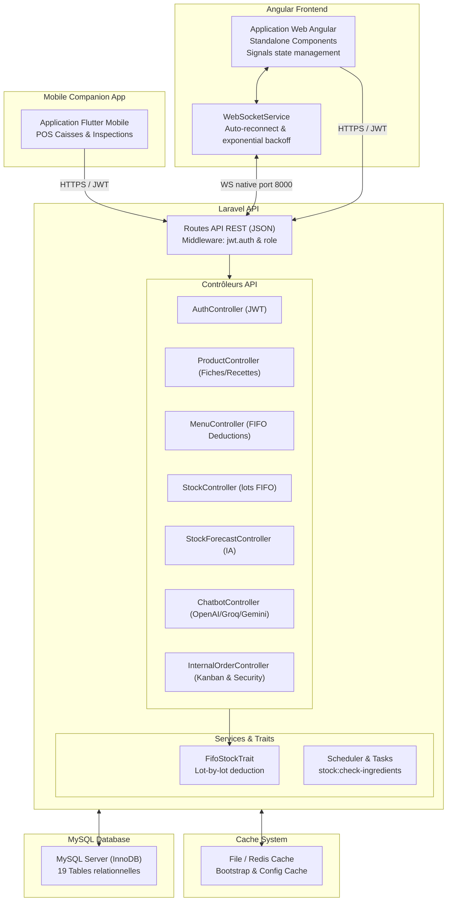
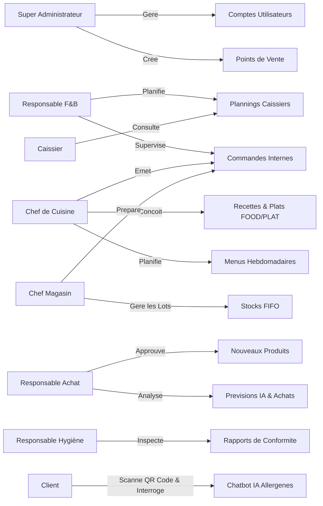
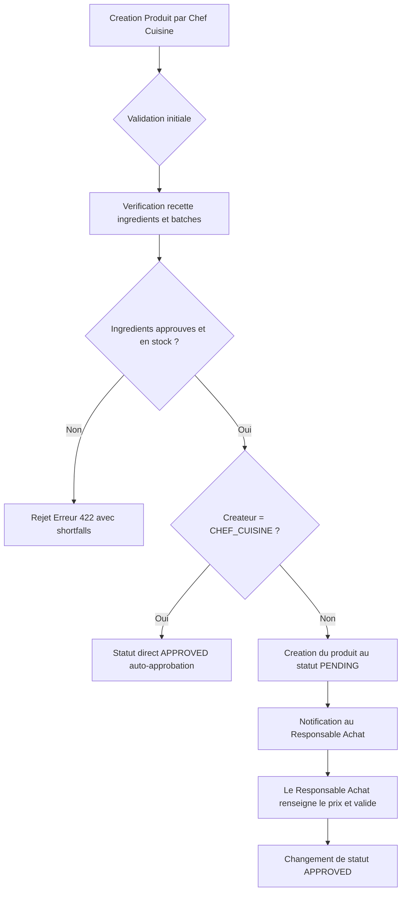
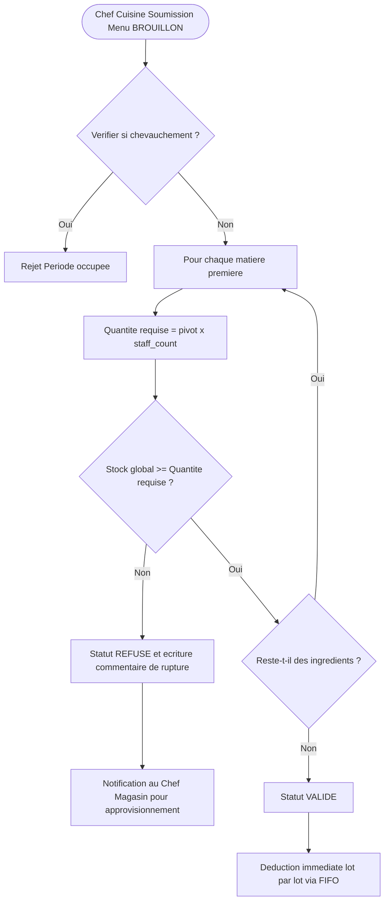
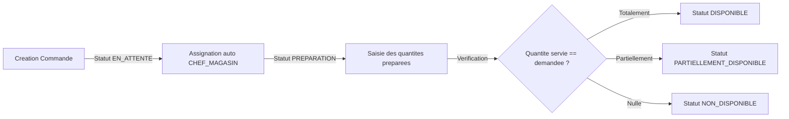
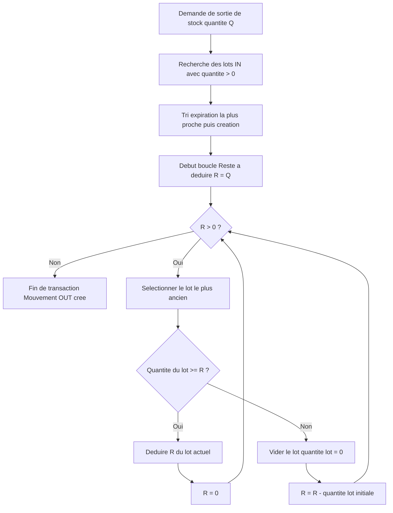

# RAPPORT TECHNIQUE — AEROSERVE (v3.2)

---

## 1. Vue d'ensemble du projet

### Description générale du système

AeroServe est un système d'information intégré de type ERP/F&B (Food and Beverage) spécialement conçu pour la gestion de la restauration dans un environnement aéroportuaire. L'application est composée d'une API REST construite sous Laravel pour le backend, d'une application web riche développée en Angular pour le portail d'administration et de gestion opérationnelle, et d'une application mobile Flutter destinée aux terminaux et aux agents mobiles (hygiène, magasin, caisse).

Le système interconnecte tous les acteurs de la chaîne de restauration, depuis l'achat des matières premières jusqu'à l'accompagnement des clients finaux en passant par la planification des plannings de caisse, l'inspection hygiénique, la préparation en cuisine, et la gestion prédictive des stocks.

### Objectifs fonctionnels

Les principaux objectifs fonctionnels du système AeroServe sont :

1. **Gestion unifiée des stocks (FIFO) :** Assurer la traçabilité lot par lot des ingrédients et boissons pour minimiser le gaspillage et respecter les réglementations sur les dates de péremption.
2. **Planification opérationnelle :** Gérer les affectations hebdomadaires des caissiers sur les différents points de vente (PDV) de l'aéroport avec des contraintes anti-chevauchement strictes.
3. **Optimisation culinaire :** Permettre au Chef de Cuisine de concevoir des fiches techniques (recettes) pour les plats préparés (produits FOOD et PLAT), de simuler et de valider les menus hebdomadaires en fonction des stocks réels.
4. **Automatisation des achats :** Prédire précisément les besoins en réapprovisionnement à partir des menus planifiés et du nombre estimé de convives (staff).
5. **Contrôle sanitaire rigoureux :** Faciliter la saisie et le suivi des audits de conformité par le Responsable Hygiène au moyen de codes QR de traçabilité.
6. **Relation client enrichie par l'IA :** Offrir aux clients de l'aéroport un accès immédiat à la composition des plats et à un chatbot intelligent d'assistance sur les allergènes via le scan d'un QR code sur table.

### Contexte métier (aéroport, restauration, staff)

Le déploiement au sein d'un aéroport impose des contraintes métier critiques :

- **Multi-sites (Points de Vente) :** Coexistence de plusieurs terminaux de vente (restaurants, comptoirs de vente à emporter, lounges VIP) répartis sur plusieurs terminaux de l'aéroport, nécessitant un approvisionnement constant depuis un dépôt central (Magasin).
- **Fluctuations de charge :** Dépendance vis-à-vis des horaires des vols et du nombre de personnel au sol (staff), nécessitant une flexibilité dans le dimensionnement des menus.
- **Réglementations strictes :** Normes d'hygiène aéroportuaire très élevées imposant une traçabilité totale sur les allergènes et les dates de péremption (DLC/DLUO).
- **Contrainte de temps :** Les passagers ont des contraintes horaires fortes. Le service doit être rapide, et les stocks en cuisine doivent être alimentés instantanément par le magasin pour éviter les ruptures de plats.

---

## 2. Architecture Générale

AeroServe adopte une architecture découplée organisée en trois couches distinctes (Client - API - Persistance), complétée par un service de messagerie temps réel bidirectionnel (WebSockets).

### Diagramme d'architecture globale



### Séparation Frontend / Backend / Base de données

- **Frontend (Angular) :** Standalone Components, Angular Signals pour la gestion de l'état réactif, et le système de flux de contrôle (`@if`, `@for`). L'affichage utilise la charte graphique premium "Sage & Stone" avec des animations fluides.
- **Backend (Laravel) :** API stateless. Il encapsule la logique métier pure, les calculs de stock FIFO, les transactions de base de données, et l'interaction avec les services d'intelligence artificielle.
- **Base de données (MySQL) :** Base de données relationnelle utilisant le moteur InnoDB pour garantir l'intégrité ACID lors des transactions de déduction de stock.

### L'application mobile (Flutter Companion)

L'application mobile compagnon en Flutter s'adresse aux profils mobiles :

- **Les Caissiers :** Consultation de planning de shifts et profil.
- **Les Inspecteurs Hygiène :** Saisie d'audits et rapports de conformité par scan de QR code.
- **Les Magasiniers :** Ajustements de lots en temps réel dans les rayonnages.

### Communication API REST (JWT Auth)

Toutes les requêtes transitent sous format JSON. L'authentification utilise des jetons **JWT (JSON Web Tokens)** transmis dans l'en-tête `Authorization: Bearer <token>`. Les notifications en temps réel s'appuient sur des connexions WebSockets.

---

## 3. Rôles & Responsabilités

Le système AeroServe est structuré autour de sept rôles d'utilisateurs authentifiés en plus des clients anonymes accédant via QR Code. Les caissiers sont désormais fusionnés dans la table des utilisateurs générale pour une gestion unifiée.

### Tableau de la matrice des rôles

| Code Rôle | Nom du Rôle | Interface Utilisée | Responsabilités Clés |
| --- | --- | --- | --- |
| `SUPER_ADMIN` | Super Administrateur | Angular Web (Full Access) | Gestion des utilisateurs, des rôles, création des points de vente, affectation des gérants, audits globaux. |
| `RESPONSABLE_FB` | Responsable F&B | Angular Web + Mobile | Suivi des commandes de réapprovisionnement, affectation hebdomadaire et planification des plannings de caisses. |
| `CHEF_CUISINE` | Chef de Cuisine | Angular Web (Cuisine) | Gestion des produits culinaires (FOOD + PLAT), écriture des recettes, planification du menu, validation de production. |
| `CHEF_MAGASIN` | Chef Magasin | Angular Web + Mobile | Contrôle des stocks du magasin central, mouvements d'entrée/sortie, traitement FIFO, suivi des DLC, traitement des commandes internes. |
| `RESPONSABLE_ACHAT` | Responsable Achat | Angular Web (Achats) | Approbation commerciale des produits, prix de vente, prévisions d'achat IA. Voir uniquement produits commercial + matiere_premiere. |
| `RESPONSABLE_HYGIENE` | Responsable Hygiène | Angular Web + Mobile | Rapports d'audit sanitaire et de traçabilité sur les lots d'ingrédients. |
| `CAISSIER` | Caissier | Application Mobile + Web | Consultation de son planning de shifts de travail, discussion avec le chatbot santé. |
| `CLIENT` | Client Aéroport | Interface Web Mobile (QR Code) | Consultation interactive de la composition d'un plat par scan et discussion avec le chatbot IA. |

### Diagramme des rôles



---

## 4. Modèle de Données

Le schéma de base de données est relationnel et optimisé. Les tables sales et sale_items ont été supprimées suite à la réorientation métier de l'application.

### Liste exhaustive des tables et colonnes principales

#### Table 1 : `roles`

- `id` (BigInt, PK, Auto-Increment) : Identifiant du rôle.
- `name` (String, Unique, Not Null) : Code du rôle (ex: `SUPER_ADMIN`, `CHEF_CUISINE`).
- `description` (String, Nullable) : Description lisible.

#### Table 2 : `airports`

- `id` (BigInt, PK, Auto-Increment) : Identifiant de l'aéroport.
- `name` (String, Not Null) : Nom de l'aéroport.
- `code` (String, Unique, Not Null) : Code IATA.
- `country` (String, Not Null) : Pays.

#### Table 3 : `points_de_vente`

- `id` (BigInt, PK, Auto-Increment) : Identifiant unique.
- `name` (String, Not Null) : Nom commercial.
- `type` (String, Not Null) : restaurant, cafe, boutique, lounge.
- `location` (String, Nullable) : Emplacement physique.
- `airport_id` (Foreign Key, Not Null) : Aéroport d'appartenance.
- `responsable_fb_id` (Foreign Key, Nullable) : Gérant FB affecté.

#### Table 4 : `users`

- `id` (BigInt, PK, Auto-Increment) : Identifiant unique de l'utilisateur.
- `first_name` (String, Not Null) : Prénom.
- `last_name` (String, Not Null) : Nom.
- `email` (String, Unique, Not Null) : Email de connexion.
- `password` (String, Not Null) : Mot de passe hashé (cast `'hashed'` dans le modèle User).
- `role_id` (Foreign Key, Nullable) : Référence vers `roles`.
- `point_de_vente_id` (Foreign Key, Nullable) : Point de vente principal.
- `status` (String, Default: 'active') : active, inactive.
- `caissier_role` (String, Nullable) : Rôle caissier unifié (ex: `CAISSIER`).
- `caissier_status` (String, Nullable) : Statut (ex: `approved`, `pending`).
- `avatar` (String, Nullable) : Fichier image de profil.
- `username` (String, Unique, Nullable) : Pseudonyme.

#### Table 5 : `categories`

- `id` (BigInt, PK, Auto-Increment) : Identifiant unique.
- `name` (String, Not Null) : Nom de la catégorie.
- `code` (String, Unique, Nullable) : Code technique.
- `type` (String, Not Null) : food, commercial, matiere_premiere, **plat**.

#### Table 6 : `products`

- `id` (BigInt, PK, Auto-Increment) : Identifiant unique.
- `name` (String, Unique, Not Null) : Nom du produit.
- `description` (Text, Nullable) : Description ou ingrédients.
- `type` (String, Not Null) : food, commercial, matiere_premiere, **plat**.
- `category_id` (Foreign Key, Nullable) : Catégorie associée.
- `price` (Decimal (8,2), Nullable) : Prix de vente public.
- `is_active` (Boolean, Default: true) : Disponibilité opérationnelle.
- `allergens` (JSON, Nullable) : Allergènes (gluten, lactose, etc.).
- `expiration_date` (Date, Nullable) : Date limite de conservation.
- `approval_status` (String, Default: 'pending') : pending, approved, rejected.
- `quantity_per_batch` (Integer, Default: 1) : Quantité produite par lot.
- `usage_status` (String, Default: 'IN_USE') : IN_USE (ingredients disponibles), OUT_OF_STOCK (rupture d'ingrédients).
- `created_by` (Foreign Key, Not Null) : Créateur.

#### Table 7 : `product_recipe`

- `food_product_id` (Foreign Key, PK, FK) : Produit préparé.
- `ingredient_id` (Foreign Key, PK, FK) : Matière première consommée.
- `quantity` (Decimal (8,2), Not Null) : Quantité requise.
- `unit` (String, Not Null) : Unité de mesure (g, ml, pièce).

#### Table 8 : `stocks`

- `id` (BigInt, PK, Auto-Increment) : Identifiant.
- `product_id` (Foreign Key, Unique, Not Null) : Produit associé.
- `quantity` (Decimal (10,2), Default: 0) : Quantité totale.
- `min_threshold` (Decimal (10,2), Default: 15) : Seuil d'alerte critique.
- `unit` (String, Default: 'piece') : Unité.

#### Table 9 : `stock_movements`

- `id` (BigInt, PK, Auto-Increment) : Identifiant de la transaction.
- `stock_id` (Foreign Key, Not Null) : Stock associé.
- `type` (String, Not Null) : in, out, adjustment.
- `quantity` (Decimal (10,2), Not Null) : Quantité.
- `reason` (String, Nullable) : Motif (ex: "Expiration", "Ajustement").
- `expiration_date` (Date, Nullable) : Date limite pour le lot.
- `user_id` (Foreign Key, Not Null) : Auteur du mouvement.

#### Table 10 : `menus`

- `id` (BigInt, PK, Auto-Increment) : Identifiant.
- `name` (String, Not Null) : Nom du menu.
- `start_date` (Date, Not Null) : Date de début.
- `end_date` (Date, Not Null) : Date de fin.
- `staff_count` (Integer, Default: 50) : Nombre de convives estimés.
- `status` (String, Default: 'BROUILLON') : BROUILLON, VALIDE, REFUSE.
- `comment` (Text, Nullable) : Commentaire de rupture.
- `created_by` (Foreign Key, Not Null) : Chef de cuisine.
- `is_active` (Boolean, Default: false) : Si appliqué.

#### Table 11 : `menu_items`

- `id` (BigInt, PK, Auto-Increment) : Identifiant.
- `menu_id` (Foreign Key, Not Null) : Menu associé.
- `product_id` (Foreign Key, Not Null) : Produit.
- `day_of_week` (String, Not Null) : Jour.
- `meal_type` (String, Not Null) : Type de repas (breakfast, lunch, etc.).

#### Table 12 : `internal_orders`

- `id` (BigInt, PK, Auto-Increment) : Identifiant du bon de commande.
- `type` (String, Not Null) : food, commercial.
- `status` (String, Default: 'EN_ATTENTE') : EN_ATTENTE, DISPONIBLE, PARTIELLEMENT_DISPONIBLE, NON_DISPONIBLE.
- `created_by` (Foreign Key, Not Null) : Commanditaire.
- `assigned_to` (Foreign Key, Nullable) : Destinataire (toujours CHEF_MAGASIN).
- `pdv_id` (Foreign Key, Nullable) : Point de vente destinataire.
- `notes` (Text, Nullable) : Remarques.
- `delivery_date` (Date, Nullable) : Date souhaitée.

#### Table 13 : `internal_order_items`

- `id` (BigInt, PK, Auto-Increment) : Identifiant.
- `internal_order_id` (Foreign Key, Not Null) : Commande.
- `product_id` (Foreign Key, Not Null) : Produit.
- `quantity_requested` (Decimal (8,2), Not Null) : Demandé.
- `quantity_fulfilled` (Decimal (8,2), Default: 0) : Servie.

#### Table 14 : `plannings`

- `id` (BigInt, PK, Auto-Increment) : Identifiant de shift.
- `user_id` (Foreign Key, Not Null) : Utilisateur affecté.
- `pdv_id` (Foreign Key, Nullable) : Point de vente.
- `date` (Date, Not Null) : Date.
- `is_day_off` (Boolean, Default: false) : Jour de repos.
- `start_time` (Time, Nullable) : Heure de début.
- `end_time` (Time, Nullable) : Heure de fin.
- `shift` (String, Default: 'MATIN') : MATIN (08:00-16:00), APRES_MIDI (16:00-00:00), SOIR (00:00-08:00). Détecté automatiquement à partir de `start_time` si non fourni explicitement.
- `day_status` (String, Default: 'ON') : ON, OFF, CONGE.
- `created_by` (Foreign Key, Not Null) : Responsable F&B créateur.

#### Table 15 : `comments`

- `id` (BigInt, PK, Auto-Increment) : Identifiant.
- `body` (Text, Not Null) : Texte.
- `user_id` (Foreign Key, Not Null) : Auteur.
- `commentable_type` (String, Not Null) : Liaison polymorphique (Menu, Product).
- `commentable_id` (BigInt, Not Null) : Identifiant de l'objet lié.

#### Table 16 : `notifications`

- `id` (BigInt, PK, Auto-Increment) : Identifiant.
- `user_id` (Foreign Key, Not Null) : Destinataire.
- `title` (String, Not Null) : Titre.
- `message` (Text, Not Null) : Message.
- `type` (String, Not Null) : info, warning, alert, success.
- `is_read` (Boolean, Default: false) : Statut de lecture.
- `data` (JSON, Nullable) : Métadonnées associées.

#### Table 17 : `hygiene_reports`

- `id` (BigInt, PK, Auto-Increment) : Identifiant.
- `product_id` (Foreign Key, Not Null) : Produit inspecté.
- `inspected_by` (Foreign Key, Not Null) : Inspecteur Hygiène.
- `allergens_verified` (Boolean, Default: false) : Allergènes validés.
- `expiration_verified` (Boolean, Default: false) : DLC vérifiée.
- `status` (String, Default: 'en_cours') : conforme, non_conforme, en_cours.
- `remarks` (Text, Nullable) : Commentaires du responsable.

#### Table 18 : `purchase_needs`

- `id` (BigInt, PK, Auto-Increment) : Identifiant.
- `menu_id` (Foreign Key, Not Null) : Menu d'origine.
- `week_start` (Date, Not Null) : Début de la semaine.
- `staff_count` (Integer, Not Null) : Effectif de référence.
- `generated_at` (Timestamp, Not Null) : Date de calcul.

#### Table 19 : `purchase_need_items`

- `id` (BigInt, PK, Auto-Increment) : Identifiant de la ligne.
- `purchase_need_id` (Foreign Key, Not Null) : Besoin parent.
- `ingredient_id` (Foreign Key, Not Null) : Matière première.
- `ingredient_name` (String, Not Null) : Nom textuel.
- `unit` (String, Not Null) : Unité.
- `current_stock` (Decimal (8,2), Not Null) : Quantité disponible.
- `required_quantity` (Decimal (8,2), Not Null) : Requis.
- `shortfall` (Decimal (8,2), Not Null) : Manque (requis - stock).

### Relations entre entités

- **Relation Recette (`product_recipe`) :** Liaison reflexive Many-to-Many. Un produit préparé contient plusieurs ingrédients, et un ingrédient peut figurer dans plusieurs recettes.
- **Relation Stocks :** Un produit possède un unique stock global (One-to-One), et chaque stock regroupe plusieurs mouvements physiques (One-to-Many) triés par FIFO.

---

## 5. Modules Fonctionnels

Chaque rôle dispose d'un espace de travail optimisé.

### 5.1 Super Admin

- **Composants Angular :** `users.ts`, `points-de-vente.component.ts`.
- **Fonctionnalités :** CRUD complet sur les utilisateurs, création des points de vente de l'aéroport, et validation des profils des caissiers.

### 5.2 Responsable F&B

- **Composants Angular :** `plannings.component.ts`, `internal-orders.component.ts`.
- **Fonctionnalités :** Planification graphique hebdomadaire avec contrôle de chevauchement. Gestion des shifts de travail et affectation aux PDV. Suivi des commandes internes.

### 5.3 Chef de Cuisine

- **Composants Angular :** `products.component.ts` (filtré sur FOOD et PLAT), `menus.component.ts`, `internal-orders.component.ts`.
- **Fonctionnalités :** Conception de recettes de plats préparés (types `food` et `plat`), planification des menus hebdomadaires, suivi des stocks de la cuisine, duplication de menus avec analyse instantanée des besoins en ingrédients. Auto-approbation de ses propres produits (pas besoin de validation par le Responsable Achat).

### 5.4 Chef Magasin

- **Composants Angular :** `stocks.component.ts`, `internal-orders.component.ts`.
- **Fonctionnalités :** Saisie des entrées de marchandises en réserve avec dates de péremption obligatoires. Traitement des bons de commande internes émis par la cuisine. **Exclusif** : seul rôle pouvant enregistrer des mouvements de stock (Entrée/Sortie) et modifier les seuils d'alerte.

### 5.5 Responsable Achat

- **Composants Angular :** `products.component.ts` (filtré sur COMMERCIAL + MATIERE_PREMIERE uniquement), `products-validation`, `category.ts`.
- **Fonctionnalités :** Approbation finale des nouveaux produits saisis en réserve, fixation des prix de vente, et consultation des analyses de stocks de l'assistant IA. **Restriction** : ne voit que les produits de type commercial et matière première. N'a plus accès aux commandes internes (depuis v3.2).

### 5.6 Responsable Hygiène

- **Composants Angular :** `hygiene-reports.component.ts`, `hygiene-products.component.ts`.
- **Fonctionnalités :** Saisie des rapports sanitaires et de conformité des produits, vérification de l'étiquetage des allergènes. Page dédiée « Hygiene Products » pour monitorer tous les produits FOOD avec édition inline des `allergenes` et `expiration_date` directement sur les produits. Export CSV des rapports d'hygiène.

### 5.7 Caissier

- **Composants Angular :** `plannings.component.ts` (lecture seule).
- **Fonctionnalités :** Consultation de son planning hebdomadaire de shifts et interaction avec le chatbot d'assistance pour répondre aux questions de santé des clients.

### 5.8 Client (QR Code + Chatbot)

- **Fonctionnalités :** Scan du code QR d'un plat sur table, affichage de la fiche d'ingrédients et discussion avec le chatbot nutritionnel à propos des allergènes.

---

## 6. Flux Métier Critiques

### 6.1 Flux de Validation d'un Produit FOOD



### 6.2 Flux de Validation du Menu Hebdomadaire



### 6.3 Flux de Gestion des Commandes Internes Kanban



### 6.4 Flux FIFO — Gestion du Stock



---

## 7. API REST — Endpoints Principaux

| Méthode | Route | Rôle Autorisé | Paramètres Requis | Format Réponse | Description |
| --- | --- | --- | --- | --- | --- |
| `POST` | `/api/login` | Public | `email`, `password` | `{token, user}` | Connexion de l'utilisateur. |
| `POST` | `/api/forgot-password` | Public | `email` | `{message}` | Envoi de l'email de récupération. |
| `POST` | `/api/password/reset` | Public | `token`, `email`, `password` | `{message}` | Réinitialisation du mot de passe. |
| `GET` | `/api/me` | Authentifié | Aucun | `{id, email, ...}` | Profil de l'utilisateur connecté. |
| `POST` | `/api/logout` | Authentifié | Aucun | `{message}` | Révocation du jeton JWT. |
| `POST` | `/api/refresh` | Authentifié | Aucun | `{token}` | Renouvellement du jeton expiré. |
| `GET` | `/api/notifications` | Authentifié | Aucun | `Array<Notification>` | Notifications reçues par l'utilisateur. |
| `PUT` | `/api/notifications/{notification}/read` | Authentifié | Aucun | `{message}` | Marque la notification comme lue. |
| `GET` | `/api/comments` | Authentifié | `commentable_type`, `id` | `Array<Comment>` | Commentaires d'un menu ou plat. |
| `POST` | `/api/comments` | Authentifié | `body`, `commentable_type`, `id` | `Comment` | Publication d'un commentaire. |
| `POST` | `/api/chatbot/ask` | Authentifié | `product_id`, `message` | `{success, response}` | Requête à l'assistant chatbot IA. |
| `GET` | `/api/dashboard` | Authentifié | `date_from`, `date_to` | `{low_stock_count, ...}` | Indicateurs clés (KPIs) et graphes de ventes. |
| `GET` | `/api/users` | `SUPER_ADMIN` | `page` | `PaginatedArray<User>` | Liste complète des agents de l'aéroport. |
| `POST` | `/api/users` | `SUPER_ADMIN` | `first_name`, `last_name`, `email`, `role_id` | `{message, user}` | Enregistrement d'un nouvel utilisateur. |
| `GET` | `/api/points-de-vente` | `SUPER_ADMIN`, `RESPONSABLE_FB`, `CAISSIER` | Aucun | `Array<PointDeVente>` | Comptoirs opérationnels de l'aéroport. |
| `POST` | `/api/points-de-vente` | `SUPER_ADMIN` | `name`, `type`, `location`, `airport_id` | `PointDeVente` | Ajout d'un nouveau point de vente. |
| `PUT` | `/api/products/{product}/recipe` | `CHEF_CUISINE` | `ingredients: array` | `{message}` | Renseignement de la recette culinaire. |
| `GET` | `/api/menus/current-week` | `CHEF_CUISINE`, `SUPER_ADMIN` | Aucun | `Menu` | Menu hebdomadaire actif. |
| `POST` | `/api/menus` | `CHEF_CUISINE` | `name`, `start_date`, `end_date`, `staff_count` | `{message, menu}` | Enregistrement d'un brouillon de menu. |
| `POST` | `/api/menus/{menu}/submit` | `CHEF_CUISINE` | Aucun | `{message}` | Soumission et déduction FIFO. |
| `POST` | `/api/menus/{menu}/clone` | `CHEF_CUISINE` | `target_week_start`, `target_week_end` | `{message, valid}` | Copie et simulation de stock de menu. |
| `GET` | `/api/purchase-needs` | Cuisine, Magasin | Aucun | `PaginatedArray<PurchaseNeed>` | Besoins d'achats théoriques calculés. |
| `GET` | `/api/stocks` | Magasin, Cuisine, F&B | Aucun | `PaginatedArray<Stock>` | État des stocks physiques en réserve. |
| `POST` | `/api/stocks/{stock}/movements` | `CHEF_MAGASIN` | `type`, `quantity`, `expiration_date` | `{message, stock}` | Enregistrement d'un lot d'entrée. |
| `PUT` | `/api/stocks/{stock}/threshold` | `CHEF_MAGASIN` | `min_threshold` | `{message}` | Modification du seuil d'alerte. |
| `GET` | `/api/stock-forecast` | `RESPONSABLE_ACHAT` | Aucun | `Array<Forecast>` | IA : Jours de couverture restants par produit. |
| `GET` | `/api/stock-anomalies` | `RESPONSABLE_ACHAT` | Aucun | `Array<Anomaly>` | IA : Anomalies et pertes anormales détectées. |
| `GET` | `/api/stock-recommendations` | `RESPONSABLE_ACHAT` | Aucun | `Array<Recommendation>` | IA : Commandes d'achat recommandées. |
| `PUT` | `/api/products/{product}/approve` | `RESPONSABLE_ACHAT` | `approval_status`, `price` | `{message}` | Approbation commerciale d'un article. |
| `POST` | `/api/hygiene-reports` | `RESPONSABLE_HYGIENE` | `product_id`, `status`, `remarks` | `{message}` | Soumission d'un rapport de conformité. |

---

## 8. Règles Métier & Contraintes

Le système AeroServe intègre des barrières de sécurité et des contrôles métier stricts :

### 1. Limites de Planification des Plannings (Shifts)

- **Contrainte de Point de Vente :** Un caissier ne peut pas être affecté à plus de deux points de vente distincts au cours du même shift le même jour.
- **Contrainte de Chevauchement Horaire :** Le système rejette toute création d'affectation dont l'intervalle horaire (`start_time` à `end_time`) chevauche une affectation existante pour le même caissier.
- **Contrainte de Semaine Calendrier :** En cas d'enregistrement en masse (bulk insert), toutes les affectations doivent appartenir strictement à la même semaine calendrier (du lundi au dimanche).

### 2. Règles sur la Recette et les Ingrédients

- **Exigence d'Approbation :** Tous les ingrédients insérés dans la fiche recette d'un produit `FOOD` ou `PLAT` doivent obligatoirement posséder le statut d'approbation commercial `approved`.
- **Auto-approbation Chef :** Les produits créés par le Chef de Cuisine sont automatiquement approuvés (`approval_status = 'approved'`). Le Chef peut toujours éditer ses propres produits approuvés, contrairement aux autres rôles dont les produits sont verrouillés après approbation.
- **Intégrité de Rôle :** Le Chef de Cuisine conçoit les recettes, mais il lui est impossible de modifier le prix de vente public du plat, cette prérogative étant réservée au service des achats (`RESPONSABLE_ACHAT`).

### 3. Logique d'Écriture et de Validation des Menus

- **Non-Chevauchement de Période :** Il est interdit de créer deux menus hebdomadaires distincts couvrant la même période de dates.
- **Validation Statutaire :** Seuls les menus disposant du statut `BROUILLON` peuvent être modifiés ou soumis à la validation de stock. La validation vérifie les ingrédients pour les produits de type `food` et `plat`.
- **Délai FIFO :** Dès qu'un menu passe au statut `VALIDE`, le système déduit immédiatement en base de données les quantités correspondantes d'ingrédients de manière irréversible selon l'ordre d'expiration des lots.

### 4. Isolation des Commandes Internes

- **Restriction de visibilité :** L'API filtre l'indexation des commandes selon le rôle. Le `SUPER_ADMIN` a accès complet, le `RESPONSABLE_FB` accède à ses créations et aux commandes de ses points de vente, le `CHEF_CUISINE` / `CHEF_MAGASIN` accèdent aux bons créés ou assignés à leur poste, et les autres rôles ne visualisent que leurs propres commandes.
- **Validation d'autorisation :** Les routes `show`, `updateStatus`, `fulfillItem`, et `destroy` interrogent la méthode de validation `authorizeOrder` pour retourner une erreur 403 Forbidden en cas de contournement d'accès.
- **Assignation automatique :** Toutes les commandes internes sont assignées au `CHEF_MAGASIN` (depuis v3.2).

### 5. Restriction des Produits par Rôle

- **CHEF_CUISINE** voit uniquement les produits de type `food` et `plat`. La colonne "Validation" est masquée.
- **CHEF_MAGASIN** voit les produits de type `commercial` et `matiere_premiere`.
- **RESPONSABLE_ACHAT** voit les produits de type `commercial` et `matiere_premiere`. Le filtre par type est remplacé par un badge informatif.
- **RESPONSABLE_HYGIENE** voit uniquement les produits `food` approuvés.

---

## 9. Sécurité

### Processus d'authentification par jeton

Lorsqu'un utilisateur se connecte, l'application valide son mot de passe au moyen de l'algorithme de hashage sécurisé **Bcrypt**. Elle lui génère ensuite un jeton JWT contenant ses informations de rôle. Ce jeton est stocké de manière sécurisée dans le navigateur (Local Storage) et est attaché à chaque requête.

Le payload typique d'un JWT émis par AeroServe a la forme suivante :

```json
{
  "sub": "12",
  "email": "chef.cuisine@aeroserve.aero",
  "role": "CHEF_CUISINE",
  "exp": 1795325800,
  "iss": "aeroserve-auth-api"
}
```

### Mécanisme de Refresh Token

Le jeton JWT d'accès a une durée de vie courte de 60 minutes. L'application Angular intercepte les requêtes arrivant à échéance et sollicite silencieusement la route `/api/refresh` en transmettant le jeton expiré pour récupérer un nouveau token sans déconnecter l'utilisateur.

### Protection des routes (Middleware)

Le contrôle d'accès est doublement vérifié :

- **Au niveau du backend (Laravel) :** Utilisation du middleware `role` pour valider que l'utilisateur possède le rôle requis pour l'action.
- **Au niveau du frontend (Angular) :** Utilisation des `route guards` pour masquer les pages inaccessibles.

---

## 10. Schedulers & Automatisations

Plusieurs processus automatisés tournent en arrière-plan sur le serveur Laravel.

### Tableau des tâches planifiées

| Commande Artisan | Fréquence | Déclencheur | Description technique & Impact |
| --- | --- | --- | --- |
| `stock:check-ingredients` | Toutes les heures (`hourly()`) | Laravel Scheduler | Parcourt tous les produits de type `food` et `plat` approuvés. Si l'un des ingrédients indispensables de sa recette affiche un stock de 0 ou insuffisant dans le lot d'entrée, le produit passe automatiquement à `is_active = false` (et `usage_status = 'OUT_OF_STOCK'`). À l'inverse, si le stock d'ingrédients redevient positif (réapprovisionnement), le produit repasse à `is_active = true` (et `usage_status = 'IN_USE'`). Impact : évite que les caissiers ne vendent des plats impossibles à servir. |
| `menu:planning-reminder` | Chaque jeudi à 20:00 | Laravel Scheduler | Vérifie si un menu hebdomadaire est déjà enregistré en base pour la semaine suivante. Si aucun menu n'est trouvé, il génère une notification critique à destination de tous les profils de type `CHEF_CUISINE`. |

---

## 11. Notifications

Le système de notification d'AeroServe relie les événements clés du stock et des commandes aux rôles concernés.

### Tableau de routage des notifications

| Événement déclencheur | Destinataires | Type | Message standard |
| --- | --- | --- | --- |
| Assignation d'un RESPONSABLE_FB à un PDV | Le RESPONSABLE_FB assigné | Info | "Vous avez été affecté(e) comme responsable du point de vente [nom]." |
| Création d'une commande interne | `CHEF_MAGASIN` | Info | "Une nouvelle commande interne de type [type] a été créée et vous a été assignée." |
| Refus automatique d'un menu hebdomadaire | `CHEF_MAGASIN` | Warning | "Le menu [nom] a été refusé. Des ingrédients manquent en stock." |
| Refus automatique d'un menu hebdomadaire | `RESPONSABLE_FB` | Info | "Le menu [nom] n'a pu être validé par manque de stock." |
| Stock en dessous du seuil minimum | `CHEF_MAGASIN` / `RESPONSABLE_ACHAT` | Warning | "Le stock de [produit] est bas ([quantité] unités restantes)." |
| Date d'expiration d'un lot proche (< 7j) | `CHEF_MAGASIN` / `RESPONSABLE_HYGIENE` | Alert | "Le produit [produit] expire bientôt (Lot #[id])." |
| Rapport d'hygiène déclaré Non Conforme | `CHEF_MAGASIN` / `CHEF_CUISINE` / `RESPONSABLE_ACHAT` | Alert | "Le produit #[id] a été signalé non conforme suite à une inspection." |
| Modification d'un produit par les achats | `CHEF_MAGASIN` | Info | "Le Responsable Achat a modifié le produit [nom]." |

---

## 12. Intelligence Artificielle & Fonctionnalités Avancées

AeroServe intègre des algorithmes intelligents facilitant les tâches courantes :

### 1. Assistant Chatbot Sécurisé Multi-Rôles (Clients & Agents)

Le chatbot intelligent d'AeroServe s'adapte dynamiquement selon l'identité et les droits de l'utilisateur connecté :

- **Architecture Multi-Fournisseurs :** Cascade de 3 fournisseurs d'IA (OpenAI → Groq → Gemini) + moteur local de secours. Groq utilise le format OpenAI-compatible (`/openai/v1/chat/completions`), ce qui permet de réutiliser exactement le même code de function calling.
- **Sécurisation et Protection de la Vie Privée :** Afin d'empêcher les fuites de données transversales, chaque utilisateur n'accède qu'aux informations importantes de son propre compte. Le backend génère à chaque requête un résumé textuel complet (`getUserContextText`) contenant le profil de l'agent, ses 5 derniers shifts et ses 5 dernières commandes internes, puis l'injecte de façon invisible dans le prompt système (`systemRole`) de l'IA (OpenAI GPT-4o-mini, Groq Llama 3.1 8B ou Gemini 1.5 Flash). Le chatbot refuse formellement de répondre à toute question portant sur des comptes tiers ou des données étrangères.
- **Function Calling natif :** Le chatbot n'utilise plus de liste statique de noms de produits injectée dans le prompt. Il exploite désormais le **function calling / tool calling** natif de chaque fournisseur d'IA avec trois outils :
  1. `chercher_produits(query)` — recherche de produits par nom/type/mot-clé
  2. `obtenir_details_produit(product_id)` — détails complets avec stock, hygieneReports, catégorie
  3. `obtenir_tous_produits()` — catalogue complet des produits actifs
  
  Le flux : l'IA décide d'appeler une fonction → PHP exécute la requête DB via `executeToolCall()` → résultat JSON retourné → l'IA répond sur la base de données réelles.
- **Mode Santé Exclusif pour le Caissier :** Pour le rôle `CAISSIER`, le chatbot n'autorise que les questions de santé (diabète, allergies, intolérance au gluten ou lactose) posées par les clients de l'aéroport au comptoir, à condition d'avoir scanné/sélectionné un produit. L'IA se base strictement sur les fiches d'ingrédients du produit et les rapports d'audits rédigés par le responsable Hygiène (`HygieneReport`), en rejetant poliment toute question d'ordre logistique, financier, ou de planning.
- **Rejet strict des hors-sujet :** Le chatbot refuse systématiquement les salutations ("Bonjour", "How are you?") et questions hors-sujet ("Quel temps fait-il ?"). Règle dure dans le prompt système + méthode `isOnTopicMessage()` avec détection de 50+ mots-clés et blacklist de salutations (FR + EN + AR).
- **Moteur de Secours Local (Sans Emojis) :** En cas d'indisponibilité des API d'IA externes, le système bascule automatiquement sur un parseur de règles local (`getLocalNlpResponse` et `getLocalGeneralResponse`). Ce moteur analyse par expressions régulières la présence d'allergènes courants et de pathologies (comme le diabète ou l'hypertension) en arabe et en français, et formule des réponses claires sans aucun emoji. Les réponses sont basées **strictement** sur les données des rapports d'hygiène du Responsable Hygiène — aucune liste de mots-clés injectée.

### 2. Prédiction des Besoins d'Achat

Lors de la saisie d'un menu par la cuisine, le système analyse l'historique et projette le stock nécessaire pour couvrir les besoins du personnel de l'aéroport (`staff_count`). Il isole automatiquement les shortfalls théoriques et pré-remplit les propositions de commandes fournisseurs.

### 3. Recommandations anti-gaspillage (Chef Magasin)

Le contrôleur `StockForecastController.php` fournit des outils d'aide à la décision :

- **Consommation moyenne mobile (Daily Average) :** Calculée sur une fenêtre glissante de 30 jours.
- **Prédiction d'épuisement (Days Left) :** Divise le stock physique restant par la consommation journalière moyenne. Si `Days Left <= 3`, le statut passe à CRITIQUE.
- **Détection des anomalies de consommation :** Alerte si le volume de sorties d'un produit sur une seule journée dépasse de trois fois la moyenne habituelle (perte, vol, etc.).
- **Quantités recommandées de commande :** Suggère la commande exacte nécessaire pour couvrir 30 jours de fonctionnement.

---

## 13. Backlog & User Stories

Pour assurer le suivi des développements, voici le backlog fonctionnel :

| ID | Rôle cible | User Story | Priorité |
| --- | --- | --- | --- |
| US01 | Client | En tant que client, je veux scanner un QR Code sur ma table pour voir la composition de mon plat et poser des questions sur les allergènes. | Haute |
| US02 | Chef de Cuisine | En tant que chef, je veux concevoir des fiches recettes en déclarant des ingrédients et simuler le menu de la semaine pour m'assurer que le stock est suffisant. | Critique |
| US03 | Chef Magasin | En tant que magasinier, je veux enregistrer les entrées de marchandises en précisant les dates d'expiration pour assurer une rotation FIFO. | Critique |
| US04 | Responsable F&B | En tant que responsable F&B, je veux créer le planning des caissiers sans risquer de conflits d'horaires. | Haute |
| US05 | Responsable Achat | En tant qu'acheteur, je veux consulter les prédictions d'épuisement de stock calculées par l'IA pour commander les justes quantités. | Moyenne |
| US06 | Responsable Hygiène | En tant qu'inspecteur, je veux saisir des rapports de conformité pour bloquer la vente de lots non conformes. | Haute |
| US07 | Caissier | En tant que caissier, je veux voir mon planning hebdomadaire de shifts. | Haute |

---

## 14. Corrections & Améliorations Apportées

### Session 0 — Corrections initiales (avant juin 2026)

#### 1. Correction de l'algorithme d'activation des produits (`CheckIngredientStock.php`)

- **Problème :** La boucle de contrôle de stock s'arrêtait dès qu'un ingrédient de la recette affichait un stock valide, gardant le plat actif même si d'autres ingrédients indispensables étaient totalement en rupture.
- **Solution :** Réécriture de la boucle pour exiger que **tous** les ingrédients associés possèdent un stock supérieur à zéro afin de maintenir le produit actif.

#### 2. Résolution des colonnes obsolètes dans le Seeder (`SampleDataSeeder.php`)

- **Problème :** Le seeder échouait suite à une migration ayant renommé les colonnes de la table `menus` de `week_start`/`week_end` en `start_date`/`end_date`.
- **Solution :** Remplacement global des termes obsolètes dans le fichier de seeding par les nouveaux champs.

#### 3. Résolution des exceptions de renommage de la table caisse

- **Problème :** Les tables `plannings` ont vu leur colonne de clé étrangère `caissier_id` renommée en `user_id` suite à la fusion de la table des caissiers dans la table générale des utilisateurs.
- **Solution :** Mise à jour des clés étrangères dans le modèle `User.php` et correction des requêtes d'insertion du seeder.

#### 4. Négation logique de l'alerte planning sur le Dashboard Frontend

- **Problème :** L'alerte de menu non planifié s'affichait lorsque le menu était planifié.
- **Solution :** Correction dans le template HTML Angular.

#### 5. Intégration de la table des produits expirés pour le Chef Magasin

- **Problème :** Le Chef Magasin ne disposait pas d'une vue tabulaire claire des produits périmés sur son Dashboard.
- **Solution :** Ajout d'une table HTML premium bouclant sur la collection `role_specific.expired_batches_list`.

---

### Session 1 — Correctifs v3.0 (8 juin 2026)

#### 6. Notifications PDV lors de l'assignation d'un gérant

- **Fichier :** `PointDeVenteController.php`
- **Problème :** Lorsqu'un RESPONSABLE_FB était assigné à un Point de Vente, aucune notification n'était envoyée.
- **Solution :** Ajout de `Notification::create()` dans `store()` et `update()` quand `responsable_fb_id` est défini.

#### 7. Auto-approbation des produits CHEF_CUISINE

- **Fichier :** `ProductController.php`
- **Problème :** Les produits créés par le Chef de Cuisine nécessitaient l'approbation du Responsable Achat, alors que le chef est responsable de ses propres recettes.
- **Solution :** `approval_status = 'approved'` si le créateur est CHEF_CUISINE, `'pending'` sinon.

#### 8. Chef peut éditer ses propres produits approuvés

- **Fichier :** `products.component.ts` (frontend)
- **Problème :** La méthode `isLockedField()` verrouillait l'édition de tous les produits approuvés, y compris ceux du chef.
- **Solution :** `if (this.isChefCuisine) return false;` en début de `isLockedField()`.

#### 9. Filtre ingrédients disponibles

- **Fichier :** `products.component.ts` (frontend)
- **Problème :** Le getter `availableIngredients` retournait TOUS les produits (y compris COMMERCIAL), alors qu'une recette ne peut contenir que des RAW_MATERIAL.
- **Solution :** Filtrage sur `type === 'matiere_premiere'`.

#### 10. Menu Builder — source des produits

- **Fichier :** `menus.component.ts` (frontend)
- **Problème :** Le constructeur de menu chargeait les produits FOOD au lieu des RAW_MATERIAL pour composer les menus quotidiens.
- **Solution :** Appel API avec `{ type: 'matiere_premiere', all_types: true }` pour bypasser le filtre `type='food'` du backend.

#### 11. Page Hygiène Produits (nouvelle)

- **Fichiers :** `hygiene-products.component.ts`, `app.routes.ts`, `layout.component.ts`
- **Fonctionnalité :** Page dédiée pour RESPONSABLE_HYGIENE pour monitorer tous les produits FOOD, avec édition inline des `allergenes` et `expiration_date`.
- **Backend :** Endpoint `PUT /api/products/{product}/hygiene` via `ProductController::hygieneUpdate()`.

#### 12. Export CSV des rapports d'hygiène

- **Fichiers :** `HygieneReportController.php` (méthode `export()`), `api.service.ts` (méthode `getBlob()`), `hygiene-reports.component.ts`
- **Route :** `GET /api/hygiene-reports/export`

#### 13. Chatbot — Function Calling (refactor majeur)

- **Fichier :** `ChatbotController.php`
- **Problème :** Liste statique de noms de produits injectée dans le prompt → fragile et non-scalable.
- **Solution :** Rewrite complet pour utiliser le **function calling natif** des 3 fournisseurs (OpenAI, Groq, Gemini) avec 3 outils. L'IA appelle les fonctions → PHP exécute la requête DB → résultat JSON → l'IA répond sur données réelles.

#### 14. Chatbot — Rejet strict des hors-sujet

- **Fichier :** `ChatbotController.php`
- **Problème :** Le chatbot répondait aux salutations et questions hors-sujet.
- **Solution :** Règle dure dans le prompt système + méthode `isOnTopicMessage()` avec 50+ mots-clés et blacklist de salutations (FR + EN + AR).

#### 15. Planning — Auto-détection du shift depuis l'heure

- **Fichiers :** `PlanningController.php` (backend), `plannings.component.ts` (frontend)
- **Problème :** Le changement de `start_time` ne mettait pas à jour le label `shift`.
- **Solution :** Méthode `determineShiftFromTime()` : < 12:00 → MATIN, 12:00-16:59 → APRES_MIDI, >= 17:00 → SOIR. Appliquée dans `store()`, `update()`, `bulkStore()`. Frontend : `onTimeChange()` met à jour le select shift automatiquement.

---

### Session 2 — Corrections de bugs critiques (8 juin 2026)

#### 16. Mot de passe Admin non hashé (double hash)

- **Fichiers :** `DatabaseSeeder.php`, `SampleDataSeeder.php`, `User.php`
- **Problème :** Le modèle `User` utilisait le cast `'password' => 'hashed'` qui hash automatiquement, mais les seeders utilisaient aussi `bcrypt()`. Résultat : double hash → login impossible.
- **Solution :** Suppression de `bcrypt()` dans les seeders. Le cast du modèle suffit.

#### 17. Avatar par défaut manquant (.svg → .png)

- **Fichiers :** `users.ts`, `profile.ts`, `profile.html` (frontend)
- **Problème :** Le chemin fallback était `/assets/default-avatar.svg` mais le fichier réel est `default-avatar.png`.
- **Solution :** Remplacement `.svg` → `.png` + guard dans `onImageError()`.

#### 18. Routes manquantes Hygiène

- **Fichier :** `api.php`
- **Problème :** `PUT /api/products/{product}/hygiene` et `GET /api/hygiene-reports/export` n'étaient pas enregistrés dans les routes → 404.
- **Solution :** Ajout dans le groupe middleware `RESPONSABLE_HYGIENE,SUPER_ADMIN`.

---

### Session 3 — Type 'plat' et raffinages (8 juin 2026)

#### 19. Nouveau type de produit : 'plat'

- **Fichiers :** `ProductController.php`, `MenuController.php`, `PurchaseNeedController.php`, `Stock.php`, `products.component.ts`, `menus.component.ts`, modèles TypeScript, migration `add_plat_to_products_type_enum.php`
- **Problème :** Le Chef de Cuisine ne pouvait créer que des produits de type 'food'. Les menus hebdomadaires nécessitent un type distinct pour les plats préparés sans stock propre.
- **Solution :** Ajout du type `'plat'` dans les enums. Tous les controllers vérifient désormais `in_array($product->type, ['food', 'plat'])`.

#### 20. Colonne `expiration_date` manquante sur products

- **Fichiers :** Migration `add_expiration_date_to_products_table.php`, seeders
- **Problème :** La table `products` n'avait pas de colonne `expiration_date` → erreurs SQL.
- **Solution :** Migration ajoutant `$table->date('expiration_date')->nullable()->after('allergens')`.

#### 21. Suppression de l'approbation Caissier

- **Fichiers :** `caissier-approval.component.ts`
- **Problème :** Le workflow d'approbation des caissiers n'était plus pertinent.
- **Solution :** Suppression de la colonne "En attente". Les caissiers sont désormais directement actifs par défaut.

#### 22. Stock model — changement de status

- **Fichier :** `Stock.php`
- **Changement :** Les status `DISPONIBLE`/`EPUISE` remplacés par `IN_USE`/`OUT_OF_STOCK`.

#### 23. Vue Chef Cuisine — filtre élargi

- **Fichier :** `products.component.ts` (frontend)
- **Changement :** Le Chef de Cuisine voit maintenant un select pour filtrer entre "Tous", "Food" et "Plat".

#### 24. Menus — chargement des plats

- **Fichier :** `menus.component.ts` (frontend)
- **Changement :** `loadAllProducts()` charge désormais `type: 'plat'`.

---

### Session 4 — Correctifs v3.2 (9 juin 2026)

#### 25. Chatbot — Moteur local strict (basé uniquement sur les rapports d'hygiène)

- **Fichier :** `ChatbotController.php` (`getLocalNlpResponse()`)
- **Problème :** Le moteur local utilisait des listes de mots-clés injectées en dur (glutenKeywords, lactoseKeywords, etc.) — il pouvait répondre même sans données du Responsable Hygiène.
- **Solution :** Suppression de toutes les listes de mots-clés. Le moteur se base **uniquement** sur les rapports `HygieneReport` (allergens_verified, expiration_verified, remarks, status). Si pas de rapport → "Aucune donnée sanitaire enregistrée".

#### 26. Commandes internes — Assignation au Chef Magasin

- **Fichier :** `InternalOrderController.php` (`store()`)
- **Problème :** Les commandes de type `food` étaient assignées au CHEF_CUISINE (lui-même). Le chef commandait à lui-même.
- **Solution :** Toutes les commandes internes sont assignées au `CHEF_MAGASIN`, seul responsable du stock.

#### 27. Stocks — Permissions d'écriture exclusives au Chef Magasin

- **Fichiers :** `api.php` (backend), `stocks.component.ts` (frontend)
- **Problème :** Le CHEF_CUISINE avait accès aux boutons Entrée/Sortie et seuil d'alerte.
- **Solution :** Routes divisées en lecture (tous) et écriture (CHEF_MAGASIN seul). Frontend : boutons masqués pour les non-CHEF_MAGASIN, remplacés par "Lecture seule".

#### 28. Produits — Restriction par rôle

- **Fichiers :** `ProductController.php` (backend), `products.component.ts` (frontend)
- **Problème :** Le CHEF_CUISINE voyait tous les types de produits. Le RESPONSABLE_ACHAT voyait les produits food/plat qui ne le concernent pas.
- **Solution :** Backend filtre automatiquement : CHEF_CUISINE → food/plat uniquement, RESPONSABLE_ACHAT → commercial/matiere_premiere uniquement. Frontend : colonne "Validation" masquée pour CHEF_CUISINE, dropdown type remplacé par badge pour RESPONSABLE_ACHAT.

#### 29. RESPONSABLE_ACHAT — Suppression de l'accès aux commandes internes

- **Fichiers :** `api.php`, `app.routes.ts`, `layout.component.ts`
- **Problème :** Le RESPONSABLE_ACHAT avait accès à la page Commandes Internes sans rôle opérationnel dessus.
- **Solution :** Route `/internal-orders` retirée du rôle RESPONSABLE_ACHAT (frontend + backend). Lien supprimé du sidebar.

#### 30. Nettoyage du code mort (15 fichiers supprimés)

- **Fichiers supprimés :** `dashboard/chef/`, `dashboard/super-admin/`, `dashboard/responsable-fb/`, `caissier-approval/`, `slide-over/`, `dashboard-module.ts`, interfaces `Caissier`/`Sale`/`SaleItem` dans `models/index.ts`.
- **Route supprimée :** `GET /caissiers/pending` (méthode inexistante → erreur 500).
- **Routes corrigées :** Séparation des routes `internal-orders` en lecture (sans RESPONSABLE_ACHAT) et écriture (sans RESPONSABLE_ACHAT).
- **Frontend corrigé :** `app.routes.ts`, `layout.component.ts`, `dashboard.component.html` — toutes les références aux pages supprimées ont été retirées.

#### 31. Nouveau guide technique

- **Fichier :** `docs/GUIDE_TECHNIQUE.md`
- **Contenu :** Guide technique complet couvrant tous les contrôleurs, modèles, routes, architecture frontend, calculs métier (FIFO, validation menu, besoins d'achat, prévisions IA), et intégration chatbot IA (OpenAI/Groq/Gemini/Local NLP).

---

## 15. Bilan Technique

### Points forts du système

- **Architecture Modulaire et découplée :** La séparation Angular/Laravel facilite l'évolutivité.
- **Traçabilité totale par lots (FIFO) :** L'intégration native du protocole de déduction FIFO garantit une gestion rigoureuse des denrées.
- **Outils prédictifs :** Réduction du gaspillage alimentaire et des coûts de stockage grâce aux modèles d'IA.
- **Chatbot multi-fournisseurs :** Cascade OpenAI → Groq → Gemini → Local NLP avec function calling natif et isolation par rôle.
- **Sécurité renforcée (v3.2) :** Restriction des produits par rôle, permissions stock exclusives au Chef Magasin, commandes internes assignées correctement, nettoyage du code mort.

### Limitations connues

- **Dépendance aux API d'IA externes :** Si Groq et Gemini sont indisponibles, le chatbot repose sur des règles localisées.
- **Absence de module de paiement bancaire intégré :** Les ventes ne font pas l'objet de transactions bancaires réelles.

### Pistes d'évolution futures

1. **Intégration d'un module de planification automatique par IA :** Répartir automatiquement les caissiers sur les points de vente en fonction du trafic des vols.
2. **Gestion multilingue native :** Traduction complète de l'application frontend en plusieurs langues.

---

## 16. Guide d'Installation et de Déploiement

### 16.1 Déploiement du Backend (Laravel API)

1. **Cloner le projet et installer les dépendances PHP :**

   ```bash
   cd AeroserveBackendAhlem-main
   composer install
   ```

2. **Configurer l'environnement :** Copier le fichier `.env.example` en `.env` et renseigner les paramètres de base de données MySQL :

   ```env
   DB_CONNECTION=mysql
   DB_HOST=127.0.0.1
   DB_PORT=3306
   DB_DATABASE=aeroserve_db
   DB_USERNAME=root
   DB_PASSWORD=secret_password
   ```

3. **Générer les clés secrètes :**

   ```bash
   php artisan key:generate
   php artisan jwt:secret
   ```

4. **Exécuter les migrations et le seeding :**

   ```bash
   php artisan migrate:fresh --seed
   ```

5. **Démarrer le serveur local :**

   ```bash
   php artisan serve
   ```

### 16.2 Déploiement du Frontend (Angular Web)

1. **Installer les dépendances NPM :**

   ```bash
   cd AeroservefrontendAhlem-main
   npm install
   ```

2. **Configurer le point d'accès API :** Modifier `src/environments/environment.ts` pour faire pointer `apiUrl` vers le serveur Laravel local (généralement `http://127.0.0.1:8000/api`).

3. **Démarrer le serveur de développement :**

   ```bash
   npm run dev
   ```

4. **Compiler pour la production :**

   ```bash
   ng build --configuration production
   ```

### 16.3 Déploiement de l'Application Mobile (Flutter)

1. **Récupérer les packages Flutter :**

   ```bash
   cd aeroservemobileahlem-main
   flutter pub get
   ```

2. **Compiler pour Android (APK) :**

   ```bash
   flutter build apk --release
   ```
