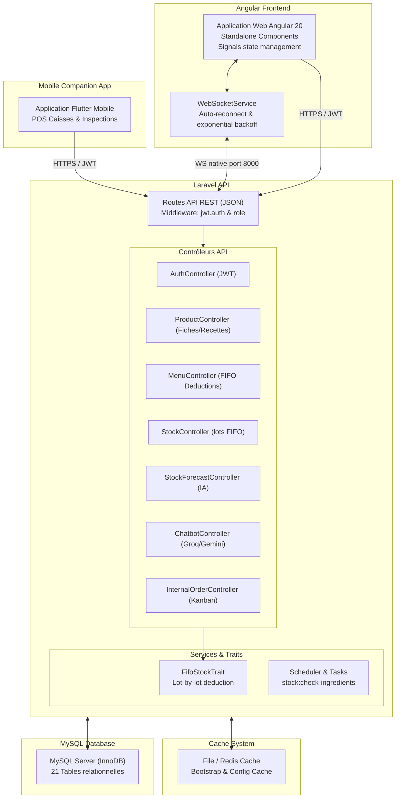
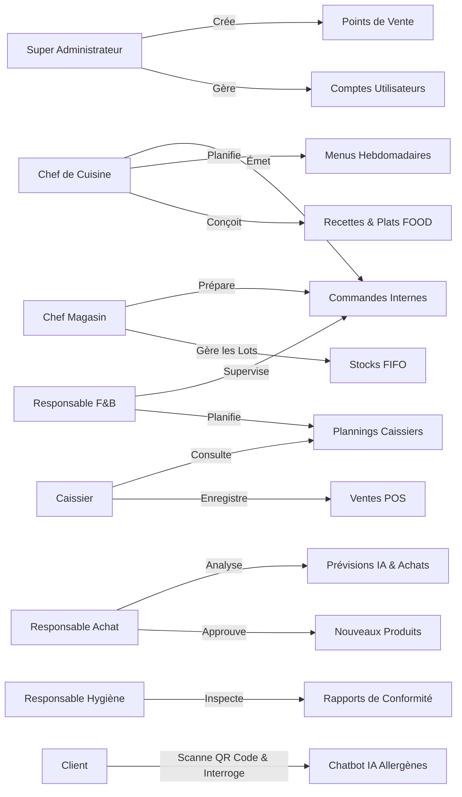
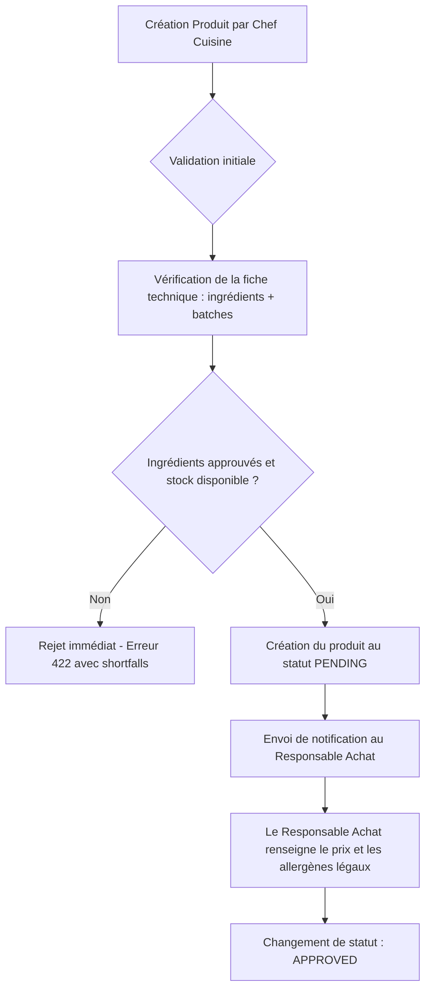
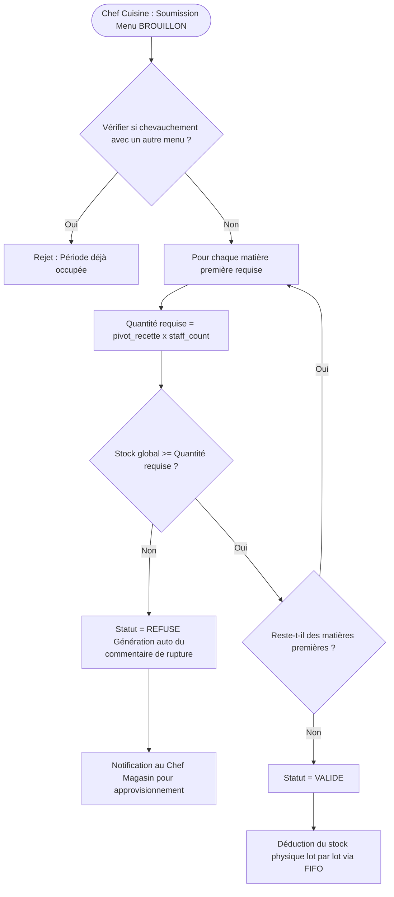
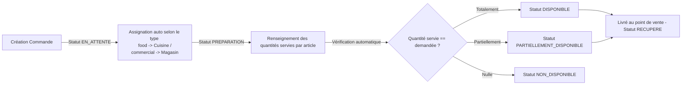
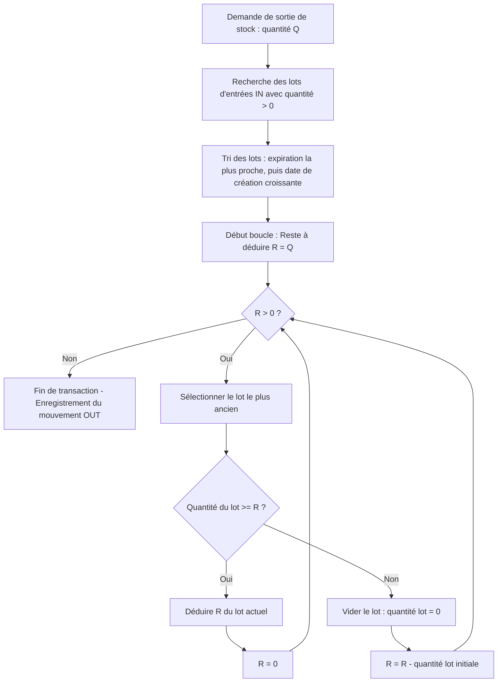
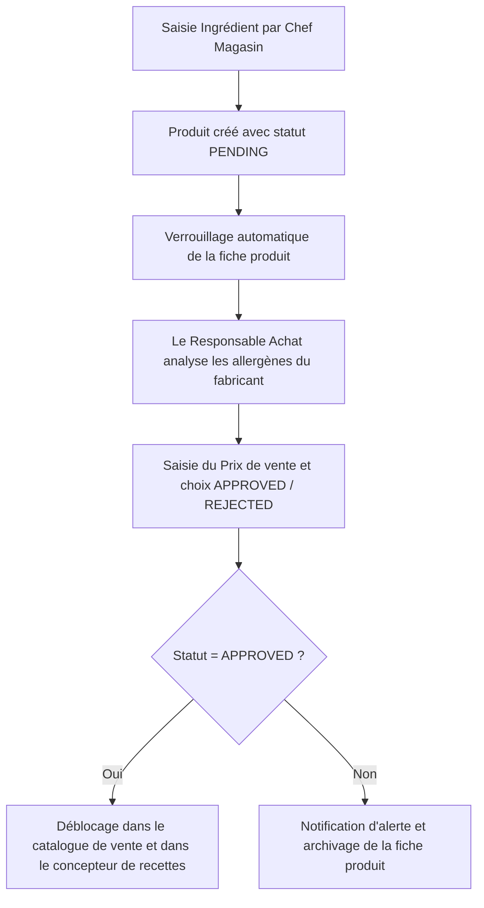

# RAPPORT TECHNIQUE — AEROSERVE

---

## 1. Vue d'ensemble du projet

### Description générale du système
**AeroServe** est un système d'information intégré de type ERP/F&B (Food and Beverage) spécialement conçu pour la gestion de la restauration dans un environnement aéroportuaire. L'application est composée d'une API REST construite sous Laravel pour le backend, d'une application web riche développée en Angular 20 pour le portail d'administration et de gestion opérationnelle, et d'une application mobile Flutter destinée aux terminaux de vente (POS) et aux agents mobiles (hygiène, magasin, caisse).

Le système interconnecte tous les acteurs de la chaîne de restauration, depuis l'achat des matières premières jusqu'à la vente aux clients finaux en passant par la planification des plannings de caisse, l'inspection hygiénique, la préparation en cuisine, et la gestion prédictive des stocks.

### Objectifs fonctionnels
Les principaux objectifs fonctionnels du système AeroServe sont :
1. **Gestion unifiée des stocks (FIFO) :** Assurer la traçabilité lot par lot des ingrédients et boissons pour minimiser le gaspillage et respecter les réglementations sur les dates de péremption.
2. **Planification opérationnelle :** Gérer les affectations quotidiennent des caissiers sur les différents points de vente (PDV) de l'aéroport avec des contraintes anti-chevauchement strictes.
3. **Optimisation culinaire :** Permettre au Chef de Cuisine de concevoir des fiches techniques (recettes) pour les plats préparés (produits `FOOD`), de simuler et de valider les menus hebdomadaires en fonction des stocks réels.
4. **Automatisation des achats :** Prédire précisément les besoins en réapprovisionnement à partir des menus planifiés et du nombre estimé de convives (staff).
5. **Contrôle sanitaire rigoureux :** Faciliter la saisie et le suivi des audits de conformité par le Responsable Hygiène au moyen de codes QR de traçabilité.
6. **Relation client enrichie par l'IA :** Offrir aux clients de l'aéroport un accès immédiat à la composition des plats et à un chatbot intelligent d'assistance sur les allergènes via le scan d'un QR code sur table.

### Contexte métier (aéroport, restauration, staff)
Le déploiement au sein d'un aéroport impose des contraintes métier critiques :
- **Multi-sites (Points de Vente) :** Coexistence de plusieurs terminaux de vente (restaurants, comptoirs de vente à emporter, lounges VIP) répartis sur plusieurs terminaux de l'aéroport, nécessitant un approvisionnement constant depuis un dépôt central (Magasin).
- **Fluctuations de charge :** Dépendance vis-à-vis des horaires des vols et du nombre de personnel au sol (staff), nécessitant une flexibilité dans le dimensionnement des menus.
- **Réglementations strictes :** Normes d'hygiène aéroportuaire très élevées imposant une traçabilité totale sur les allergènes et les dates de péremption (DLC/DLUO).
- **Contrainte de temps :** Les passagers ont des contraintes horaires fortes (embarquement imminent). Le service doit être ultra-rapide, le POS doit fonctionner de manière fluide, et les stocks en cuisine doivent être réalimentés instantanément par le magasin pour éviter les ruptures de plats affichés sur les menus.

---

## 2. Architecture Générale

AeroServe adopte une architecture découplée (headless) organisée en trois couches distinctes (Client - API - Persistance), complétée par un service de messagerie temps réel bidirectionnel (WebSockets).

### Diagramme d'architecture globale (DIAGRAMME 1)


### Séparation Frontend / Backend / Base de données
- **Frontend (Angular 20) :** Interface utilisateur modulaire utilisant les *Standalone Components*, les *Angular Signals* pour une réactivité optimale du State, et le nouveau système de contrôle de flux (`@if`, `@for`). L'affichage utilise la charte graphique premium "Sage & Stone" avec des animations fluides et des composants de slide-over.
- **Backend (Laravel) :** Fournit uniquement une API stateless. Il encapsule la logique métier pure, les calculs de stock FIFO, les orchestrations de transactions de base de données, et l'interaction avec les services d'intelligence artificielle.
- **Base de données (MySQL) :** Base de données relationnelle utilisant le moteur de stockage InnoDB garantissant le respect des propriétés ACID lors de l'exécution des transactions de déduction de stock et de ventes.

### L'application mobile (Flutter Companion)
L'application mobile compagnon est développée en Flutter pour assurer une portabilité multiplateforme rapide (Android / iOS). Elle s'adresse aux utilisateurs nomades :
- **Les Caissiers :** Qui l'utilisent comme terminal POS mobile pour encaisser les commandes directement à la table des voyageurs.
- **Les Inspecteurs Hygiène :** Qui l'utilisent sur le terrain pour scanner instantanément les codes QR collés sur les lots de matières premières et saisir leurs audits de conformité sanitaire.
- **Les Magasiniers :** Qui réalisent les inventaires et ajustements de lots en temps réel dans les rayonnages en scannant les étiquettes de stockage.

### Communication API REST (JWT Auth)
Toutes les requêtes de données transitent sous format JSON. L'authentification est gérée par des jetons **JWT (JSON Web Tokens)** auto-contenus, transmis dans l'en-tête HTTP `Authorization: Bearer <token>`. Les notifications en temps réel utilisent des connexions WebSockets natives avec reconnexion automatique et repli exponentiel (exponential backoff) en cas de perte de connectivité.

---

## 3. Rôles & Responsabilités

Le système AeroServe est architecturé autour de sept rôles d'utilisateurs authentifiés en plus des clients anonymes accédant via QR Code.

### Tableau de la matrice des rôles
| Code Rôle | Nom du Rôle | Interface Utilisée | Responsabilités Clés |
|---|---|---|---|
| `SUPER_ADMIN` | Super Administrateur | Angular Web (Full Access) | Gestion des utilisateurs, des rôles, création des points de vente, affectation des gérants, audits globaux du système. |
| `RESPONSABLE_FB` | Responsable F&B | Angular Web + Mobile | Suivi des commandes internes de réapprovisionnement, affectation hebdomadaire et planification des plannings de caisses sur les points de vente. |
| `CHEF_CUISINE` | Chef de Cuisine | Angular Web (Cuisine) | Gestion exclusive des produits culinaires (`FOOD`), écriture des recettes (ingrédients), planification du menu hebdomadaire, validation de production. |
| `CHEF_MAGASIN` | Chef Magasin | Angular Web + Mobile | Contrôle physique des stocks du magasin central, enregistrement des mouvements d'entrée/sortie, traitement FIFO, suivi des DLC. |
| `RESPONSABLE_ACHAT` | Responsable Achat | Angular Web (Achats) | Approbation commerciale des nouveaux produits, fixation des prix de vente, consultation des prévisions de consommation IA pour passation des commandes fournisseurs. |
| `RESPONSABLE_HYGIENE` | Responsable Hygiène | Angular Web + Mobile | Création des rapports d'audit sanitaire et de traçabilité sur les lots d'ingrédients et de plats préparés. |
| `CAISSIER` | Caissier | Application Mobile + Web (POS) | Enregistrement des ventes quotidiennes sur le point de vente affecté, encaissement (espèces, carte bancaire), consultation de son planning de shifts. |
| `CLIENT` | Client Aéroport | Interface Web Mobile (QR Code) | Consultation interactive de la carte des allergènes d'un plat par scan, discussion avec le chatbot IA d'allergie. |

### Diagramme des rôles (DIAGRAMME 2)


---

## 4. Modèle de Données

Le schéma de base de données est hautement relationnel et optimisé pour préserver l'intégrité référentielle.

### Liste exhaustive des tables et colonnes principales
Voici la structure détaillée des tables de l'application :

#### Table 1 : `roles`
| Colonne | Type | Propriétés | Description |
|---|---|---|---|
| `id` | BigInt | PK, Auto-Increment | Identifiant unique du rôle. |
| `name` | String | Unique, Not Null | Code du rôle (ex: `SUPER_ADMIN`, `CHEF_CUISINE`). |
| `description` | String | Nullable | Libellé lisible du rôle. |

#### Table 2 : `airports`
| Colonne | Type | Propriétés | Description |
|---|---|---|---|
| `id` | BigInt | PK, Auto-Increment | Identifiant unique de l'aéroport. |
| `name` | String | Not Null | Nom officiel de l'aéroport. |
| `code` | String | Unique, Not Null | Code IATA (ex: "TUN", "CDG"). |
| `country` | String | Not Null | Pays de l'aéroport. |

#### Table 3 : `points_de_vente`
| Colonne | Type | Propriétés | Description |
|---|---|---|---|
| `id` | BigInt | PK, Auto-Increment | Identifiant unique. |
| `name` | String | Not Null | Nom commercial (ex: "Lounge VIP Terminal 1"). |
| `type` | String | Not Null | Type : 'restaurant', 'cafe', 'boutique', 'lounge'. |
| `location` | String | Nullable | Emplacement physique précis dans le terminal. |
| `airport_id` | Foreign Key | Not Null | Lie le point de vente à son aéroport. |
| `responsable_fb_id` | Foreign Key | Nullable | Gérant affecté au point de vente. |

#### Table 4 : `users`
| Colonne | Type | Propriétés | Description |
|---|---|---|---|
| `id` | BigInt | PK, Auto-Increment | Identifiant unique de l'utilisateur. |
| `first_name` | String | Not Null | Prénom de l'utilisateur. |
| `last_name` | String | Not Null | Nom de famille de l'utilisateur. |
| `email` | String | Unique, Not Null | Adresse email pour la connexion. |
| `password` | String | Not Null | Mot de passe hashé. |
| `role_id` | Foreign Key | Nullable | Référence vers la table `roles`. |
| `point_de_vente_id` | Foreign Key | Nullable | Point de vente de rattachement principal. |
| `status` | String | Default: 'active' | État du compte ('active', 'inactive'). |
| `caissier_role` | String | Nullable | Rôle auxiliaire pour le caissier. |
| `caissier_status` | String | Nullable | Statut opérationnel du caissier. |
| `avatar` | String | Nullable | Image de profil. |
| `username` | String | Unique, Nullable | Pseudonyme de connexion. |

#### Table 5 : `categories`
| Colonne | Type | Propriétés | Description |
|---|---|---|---|
| `id` | BigInt | PK, Auto-Increment | Identifiant unique. |
| `name` | String | Not Null | Nom de la catégorie (ex: "Boissons", "Pains"). |
| `code` | String | Unique, Nullable | Code technique (ex: "BEV", "BAK"). |
| `type` | String | Not Null | Type lié : 'food', 'commercial', 'matiere_premiere'. |

#### Table 6 : `products`
| Colonne | Type | Propriétés | Description |
|---|---|---|---|
| `id` | BigInt | PK, Auto-Increment | Identifiant unique du produit. |
| `name` | String | Unique, Not Null | Nom du produit (ex: "Tomate", "Sandwich Thon"). |
| `description` | Text | Nullable | Liste des ingrédients ou description longue. |
| `type` | String | Not Null | Type : 'food', 'commercial', 'matiere_premiere'. |
| `category_id` | Foreign Key | Nullable | Catégorie associée au produit. |
| `price` | Decimal (8,2) | Nullable | Prix de vente public (géré par les Achats). |
| `is_active` | Boolean | Default: true | Indique si le produit est disponible. |
| `allergens` | JSON | Nullable | Tableau d'allergènes déclarés (gluten, lactose...). |
| `expiration_date` | Date | Nullable | Date limite de conservation. |
| `approval_status` | String | Default: 'pending' | Statut d'approbation : 'pending', 'approved', 'rejected'. |
| `quantity_per_batch` | Integer | Default: 1 | Quantité produite lors de la préparation d'un lot. |
| `created_by` | Foreign Key | Not Null | Créateur du produit. |

#### Table 7 : `product_recipe`
| Colonne | Type | Propriétés | Description |
|---|---|---|---|
| `food_product_id` | Foreign Key | PK, FK | Référence vers le produit préparé (`FOOD`). |
| `ingredient_id` | Foreign Key | PK, FK | Référence vers la matière première consommée. |
| `quantity` | Decimal (8,2) | Not Null | Quantité d'ingrédient nécessaire pour réaliser un lot. |
| `unit` | String | Not Null | Unité de mesure (g, ml, pièce). |

#### Table 8 : `stocks`
| Colonne | Type | Propriétés | Description |
|---|---|---|---|
| `id` | BigInt | PK | Identifiant unique. |
| `product_id` | Foreign Key | Unique, Not Null | Référence vers le produit associé. |
| `quantity` | Decimal (10,2) | Default: 0 | Quantité physique totale actuellement en stock. |
| `min_threshold` | Decimal (10,2) | Default: 15 | Seuil de sécurité déclenchant une alerte de stock bas. |
| `unit` | String | Default: 'piece' | Unité de stockage. |

#### Table 9 : `stock_movements`
| Colonne | Type | Propriétés | Description |
|---|---|---|---|
| `id` | BigInt | PK | Identifiant unique de la transaction. |
| `stock_id` | Foreign Key | Not Null | Référence vers le stock associé. |
| `type` | String | Not Null | Type de mouvement : 'in' (entrée de lot), 'out' (déduction FIFO), 'adjustment'. |
| `quantity` | Decimal (10,2) | Not Null | Quantité du mouvement. |
| `reason` | String | Nullable | Motif (ex: "Réception lot", "Vente #102"). |
| `expiration_date` | Date | Nullable | Date limite de consommation du lot (FIFO). |
| `user_id` | Foreign Key | Not Null | Utilisateur ayant enregistré le mouvement. |

#### Table 10 : `menus`
| Colonne | Type | Propriétés | Description |
|---|---|---|---|
| `id` | BigInt | PK | Identifiant unique. |
| `name` | String | Not Null | Nom du menu (ex: "Menu Semaine 24"). |
| `start_date` | Date | Not Null | Date de début du menu. |
| `end_date` | Date | Not Null | Date de fin du menu. |
| `staff_count` | Integer | Default: 50 | Nombre estimé de convives pour les prédictions d'achats. |
| `status` | String | Default: 'BROUILLON' | Statut : 'BROUILLON', 'VALIDE', 'REFUSE'. |
| `comment` | Text | Nullable | Commentaire automatique généré en cas de rupture de stock. |
| `created_by` | Foreign Key | Not Null | Chef de cuisine créateur. |
| `is_active` | Boolean | Default: false | Indique si le menu est actuellement appliqué. |

#### Table 11 : `menu_items`
| Colonne | Type | Propriétés | Description |
|---|---|---|---|
| `id` | BigInt | PK | Identifiant unique de la ligne. |
| `menu_id` | Foreign Key | Not Null | Référence au menu associé. |
| `product_id` | Foreign Key | Not Null | Référence au produit préparé. |
| `day_of_week` | String | Not Null | Jour de la semaine (monday, tuesday...). |
| `meal_type` | String | Not Null | Type de repas (breakfast, lunch...). |

#### Table 12 : `internal_orders`
| Colonne | Type | Propriétés | Description |
|---|---|---|---|
| `id` | BigInt | PK | Identifiant unique du bon de commande. |
| `type` | String | Not Null | Type : 'food', 'commercial'. |
| `status` | String | Default: 'EN_ATTENTE' | Statut Kanban : 'EN_ATTENTE', 'PREPARATION', 'DISPONIBLE', 'RECUPERE', 'ANNULE'. |
| `created_by` | Foreign Key | Not Null | Commanditaire (PDV ou Cuisine). |
| `assigned_to` | Foreign Key | Nullable | Destinataire pour préparation (Cuisine ou Magasin). |
| `pdv_id` | Foreign Key | Nullable | Point de vente de destination. |
| `notes` | Text | Nullable | Remarques sur la commande. |
| `delivery_date` | Date | Nullable | Date limite de livraison souhaitée. |

#### Table 13 : `internal_order_items`
| Colonne | Type | Propriétés | Description |
|---|---|---|---|
| `id` | BigInt | PK | Identifiant unique de ligne. |
| `internal_order_id` | Foreign Key | Not Null | Référence vers la commande parente. |
| `product_id` | Foreign Key | Not Null | Référence vers le produit demandé. |
| `quantity_requested` | Decimal (8,2) | Not Null | Quantité demandée. |
| `quantity_fulfilled` | Decimal (8,2) | Default: 0 | Quantité réellement préparée. |

#### Table 14 : `plannings`
| Colonne | Type | Propriétés | Description |
|---|---|---|---|
| `id` | BigInt | PK | Identifiant unique de shift. |
| `user_id` | Foreign Key | Not Null | Caissier affecté. |
| `pdv_id` | Foreign Key | Nullable | Point de vente d'affectation. |
| `date` | Date | Not Null | Date d'affectation. |
| `is_day_off` | Boolean | Default: false | Indique s'il s'agit d'un jour de repos. |
| `start_time` | Time | Nullable | Heure de début. |
| `end_time` | Time | Nullable | Heure de fin. |
| `shift` | String | Default: 'MATIN' | Shift de travail : 'MATIN', 'APRES_MIDI', 'SOIR'. |
| `day_status` | String | Default: 'ON' | Statut du jour : 'ON', 'OFF', 'CONGE'. |
| `created_by` | Foreign Key | Not Null | Planificateur (Responsable F&B). |

#### Table 15 : `sales`
| Colonne | Type | Propriétés | Description |
|---|---|---|---|
| `id` | BigInt | PK | Identifiant unique de la vente. |
| `user_id` | Foreign Key | Not Null | Caissier ayant enregistré la vente. |
| `pdv_id` | Foreign Key | Not Null | Point de vente associé. |
| `total_amount` | Decimal (8,2) | Not Null | Montant total encaissé. |
| `payment_method` | String | Default: 'cash' | Méthode : 'cash', 'card', 'other'. |

#### Table 16 : `sale_items`
| Colonne | Type | Propriétés | Description |
|---|---|---|---|
| `id` | BigInt | PK | Identifiant unique de ligne de vente. |
| `sale_id` | Foreign Key | Not Null | Référence vers la vente parente. |
| `product_id` | Foreign Key | Not Null | Référence vers le produit vendu. |
| `quantity` | Integer | Not Null | Quantité achetée. |
| `unit_price` | Decimal (8,2) | Not Null | Prix unitaire à la transaction. |
| `subtotal` | Decimal (8,2) | Not Null | Sous-total (quantité x unit_price). |

#### Table 17 : `comments`
| Colonne | Type | Propriétés | Description |
|---|---|---|---|
| `id` | BigInt | PK | Identifiant unique. |
| `body` | Text | Not Null | Contenu textuel. |
| `user_id` | Foreign Key | Not Null | Auteur du commentaire. |
| `commentable_type` | String | Not Null | Polymorphisme : 'App\Models\Menu', 'App\Models\Product'. |
| `commentable_id` | BigInt | Not Null | Identifiant de l'objet lié. |

#### Table 18 : `notifications`
| Colonne | Type | Propriétés | Description |
|---|---|---|---|
| `id` | UUID / BigInt | PK | Identifiant unique de notification. |
| `user_id` | Foreign Key | Not Null | Utilisateur destinataire. |
| `title` | String | Not Null | Titre de la notification. |
| `message` | Text | Not Null | Corps du message. |
| `type` | String | Not Null | Type : 'info', 'warning', 'alert', 'success'. |
| `is_read` | Boolean | Default: false | Indique si le message a été lu. |
| `data` | JSON | Nullable | Métadonnées contextuelles (ex: `menu_id`). |

#### Table 19 : `hygiene_reports`
| Colonne | Type | Propriétés | Description |
|---|---|---|---|
| `id` | BigInt | PK | Identifiant unique. |
| `product_id` | Foreign Key | Not Null | Produit inspecté. |
| `inspected_by` | Foreign Key | Not Null | Inspecteur hygiène. |
| `allergens_verified` | Boolean | Not Null | Allergènes validés en laboratoire/étiquetage. |
| `expiration_verified` | Boolean | Not Null | Vérification des DLC sur les lots. |
| `status` | String | Not Null | Statut : 'conforme', 'non_conforme', 'en_cours'. |
| `remarks` | Text | Nullable | Commentaires de l'inspecteur. |

#### Table 20 : `purchase_needs`
| Colonne | Type | Propriétés | Description |
|---|---|---|---|
| `id` | BigInt | PK | Identifiant unique. |
| `menu_id` | Foreign Key | Not Null | Menu hebdomadaire d'origine. |
| `week_start` | Date | Not Null | Date de début de la semaine. |
| `staff_count` | Integer | Not Null | Effectif de référence. |
| `generated_at` | Timestamp | Not Null | Date de génération du besoin. |

#### Table 21 : `purchase_need_items`
| Colonne | Type | Propriétés | Description |
|---|---|---|---|
| `id` | BigInt | PK | Identifiant unique de ligne. |
| `purchase_need_id` | Foreign Key | Not Null | Référence vers la commande parente. |
| `ingredient_id` | Foreign Key | Not Null | Matière première manquante. |
| `ingredient_name` | String | Not Null | Nom textuel à la génération. |
| `unit` | String | Not Null | Unité. |
| `current_stock` | Decimal (8,2) | Not Null | Quantité disponible lors du calcul. |
| `required_quantity` | Decimal (8,2) | Not Null | Quantité brute nécessaire pour le menu. |
| `shortfall` | Decimal (8,2) | Not Null | Quantité en pénurie (requis - disponible). |

### Relations entre entités
- **Relation Recette (`product_recipe`) :** Lien Many-to-Many réflexif sur la table `products`. Un produit de type `food` contient plusieurs produits de type `matiere_premiere`, et une matière première peut appartenir à plusieurs recettes.
- **Relation Stocks & Mouvements :** Un produit possède une unique ligne de stock global (`One-to-One`), tandis que cette ligne de stock possède de multiples mouvements (`One-to-Many`) représentant les lots physiques réels.

---

## 5. Modules Fonctionnels

Chaque rôle dispose d'un espace de travail optimisé pour ses contraintes opérationnelles.

### 5.1 Super Admin
Le Super Administrateur gère les fondations du système.
- **Composants Angular clés :** `users.ts`, `points-de-vente.component.ts`.
- **Fonctionnalités :** Activation/désactivation des comptes utilisateurs, assignation des points de vente aux différents terminaux de l'aéroport, validation finale des caissiers après signature de leur charte d'utilisation.

### 5.2 Responsable F&B
Le gérant de la restauration aéroportuaire supervise les plannings et les flux internes.
- **Composants Angular clés :** `plannings.component.ts`, `internal-orders.component.ts`.
- **Fonctionnalités :** Planification graphique hebdomadaire avec contrôle de chevauchement. Suivi de la charge opérationnelle de la cuisine et de l'entrepôt.

### 5.3 Chef de Cuisine
Il s'agit du module le plus complet, regroupant la gestion de la préparation culinaire.

#### 5.3.1 Gestion Produits FOOD
Lorsqu'il accède à l'écran de création d'articles (`products.component.ts`), le système filtre ses options pour n'autoriser que le type `food`. Les champs administratifs comme le prix public sont cachés. Il doit définir les ingrédients constitutifs via la liaison dynamique `ingredients`. Le backend Laravel vérifie la conformité de la recette :
```php
$request->validate([
    'name' => 'required|string|max:255|unique:products,name',
    'type' => 'required|in:food',
    'quantity_per_batch' => 'required|integer|min:1',
    'ingredients' => 'required|array|min:1',
    'ingredients.*.product_id' => 'required|exists:products,id',
    'ingredients.*.quantity' => 'required|numeric|min:0.01',
]);
```

#### 5.3.2 Menu Hebdomadaire
Le Chef de Cuisine organise le planning des repas de la semaine dans `menus.component.ts`. Lors de la soumission du menu, le système vérifie instantanément si la cuisine dispose de stocks suffisants pour nourrir le personnel de l'aéroport.

#### 5.3.3 Commandes Internes — Vue Kanban
Afin de réclamer des matières premières au magasin central, le Chef de Cuisine émet une commande interne. Les commandes de type `food` lui sont automatiquement assignées, tandis que les commandes de type `commercial` sont assignées au Chef Magasin. La progression de la commande est visible sous forme de tableau Kanban interactif.

#### 5.3.4 Dashboard Personnalisé
Le tableau de bord réactif du Chef de Cuisine regroupe 5 widgets essentiels pour son pilotage quotidien :
1. **Widget A — Taux de disponibilité des ingrédients :** Pourcentage global de matières premières validées disposant d'un stock positif par rapport au catalogue d'ingrédients total.
2. **Widget B — Statut du menu de la semaine :** Indicateur d'état dynamique (`VALIDE`, `BROUILLON` ou `EN_ATTENTE_STOCK` si des produits manquent).
3. **Widget C — Volume d'activité :** Nombre de bons de commandes cuisine en cours de traitement pour la journée.
4. **Widget D1 — Alerte Ingrédients sous-seuil :** Liste des ingrédients requis pour les menus validés de la semaine en cours dont le stock résiduel est inférieur au seuil de sécurité minimum.
5. **Widget D2 — Planification du menu futur :** Indicateur signalant si le menu de la semaine suivante est déjà rédigé ou s'il doit être créé en urgence (avec alerte le jeudi soir).

#### 5.3.5 Duplication Intelligente du Menu
Fonctionnalité permettant de copier le menu d'une semaine passée vers une semaine cible. Lors du clonage, AeroServe lance immédiatement une simulation de contrôle des stocks de la cuisine sur la base des ingrédients requis et affiche instantanément la liste détaillée des matières premières à commander pour valider ce menu.

#### 5.3.6 Prédiction des Besoins d'Achats
Généré automatiquement dès qu'un brouillon de menu est enregistré ou modifié. AeroServe calcule l'écart théorique :
$$\text{Shortfall} = \max(0, (\text{Quantité Pivot Ingrédient} \times \text{Nombre Staff}) - \text{Stock Actuel})$$
Cette liste de pénuries prévisionnelles est ensuite stockée dans la table `purchase_needs` pour guider le travail du Chef Magasin et du Responsable Achat.

### 5.4 Chef Magasin
Gère l'entrepôt d'alimentation et de boissons.
- **Composants Angular clés :** `stocks.component.ts`.
- **Fonctionnalités :** Saisie des mouvements de stock entrants (type `in`) avec obligation d'y associer une date d'expiration. Visualisation des alertes de péremption imminente.

### 5.5 Responsable Achat
Le décisionnaire commercial du système.
- **Composants Angular clés :** `category.ts`, `products.component.ts`.
- **Fonctionnalités :** Approbation finale des nouveaux produits avec fixation des prix de vente et déclaration des allergènes. Consultation des prévisions d'achat pour négocier avec les fournisseurs.

### 5.6 Responsable Hygiène
Garant de la sécurité sanitaire au sein de l'aéroport.
- **Composants Angular clés :** `hygiene-reports.component.ts`.
- **Fonctionnalités :** Rédaction de fiches de contrôle sur la conformité de l'étiquetage des allergènes et de la fraîcheur des produits par scan de QR Code.

### 5.7 Caissier
Opérateur de vente directe sur les points de vente aéroportuaires.
- **Composants Angular clés :** `sales.component.ts`.
- **Fonctionnalités :** Enregistrement tactile des paniers de vente, déduction de stock en temps réel via FIFO, consultation de son planning de gardes attribué.

### 5.8 Client (QR Code + Chatbot)
Interface web publique ouverte aux clients de l'aéroport.
- **Fonctionnalités :** Scan du code QR imprimé sur le plat, consultation de la fiche nutritionnelle, et discussion avec un chatbot IA à propos des allergènes.

---

## 6. Flux Métier Critiques

### 6.1 Flux de Validation d'un Produit FOOD (DIAGRAMME 4)


### 6.2 Flux de Validation du Menu Hebdomadaire (DIAGRAMME 5)


### 6.3 Flux de Gestion des Commandes Internes (Kanban) (DIAGRAMME 6)


### 6.4 Flux FIFO — Gestion du Stock (DIAGRAMME 7)
L'algorithme FIFO garantit que les produits stockés en premier ou périmant en premier sont sortis en priorité absolue :


### 6.5 Flux d'Approbation des Produits (DIAGRAMME 9)
Le flux d'approbation commerciale garantit qu'aucun ingrédient ou produit d'épicerie n'est utilisé dans l'aéroport sans avoir été validé par la cellule d'achats pour éviter des dérives de coûts ou des manquements d'allergènes.


---

## 7. API REST — Endpoints Principaux

### Tableau complet et détaillé des routes API
| Méthode | Route | Rôle Autorisé | Paramètres Requis | Format Réponse | Description |
|---|---|---|---|---|---|
| `POST` | `/api/login` | Public | `email`, `password` | `{token: string, user: object}` | Authentification et émission du jeton JWT. |
| `POST` | `/api/forgot-password` | Public | `email` | `{message: string}` | Envoi de l'email de récupération de compte. |
| `POST` | `/api/password/reset` | Public | `token`, `email`, `password` | `{message: string}` | Enregistrement du nouveau mot de passe. |
| `GET` | `/api/me` | Authentifié | Aucun | `{id: int, email: string, ...}` | Détails du compte de l'utilisateur connecté. |
| `POST` | `/api/logout` | Authentifié | Aucun | `{message: string}` | Révocation immédiate du token JWT. |
| `POST` | `/api/refresh` | Authentifié | Aucun | `{token: string}` | Renouvellement du jeton expiré. |
| `GET` | `/api/notifications` | Authentifié | Aucun | `PaginatedArray<Notification>` | Liste toutes les notifications reçues. |
| `PUT` | `/api/notifications/{notification}/read` | Authentifié | Aucun | `{message: string}` | Marque la notification comme lue. |
| `GET` | `/api/comments` | Authentifié | `commentable_type`, `id` | `Array<Comment>` | Commentaires associés à un plat ou menu. |
| `POST` | `/api/comments` | Authentifié | `body`, `commentable_type`, `id` | `Comment` | Publication d'une remarque ou d'un avis. |
| `POST` | `/api/chatbot/ask` | Public | `product_id`, `message` | `{success: bool, response: string}` | Question au chatbot nutritionnel IA. |
| `GET` | `/api/dashboard` | Shared | `date_from`, `date_to` | `{total_sales: decimal, ...}` | Statistiques agrégées et widgets par rôle. |
| `GET` | `/api/users` | `SUPER_ADMIN` | `page` | `PaginatedArray<User>` | Liste du personnel de l'aéroport. |
| `POST` | `/api/users` | `SUPER_ADMIN` | `first_name`, `last_name`, `email`, `role_id` | `{message: string, user: object}` | Ajout d'un nouvel agent au système. |
| `GET` | `/api/points-de-vente` | `SUPER_ADMIN`, `RESPONSABLE_FB` | Aucun | `Array<PointDeVente>` | Points de vente actifs de la plateforme. |
| `POST` | `/api/points-de-vente` | `SUPER_ADMIN` | `name`, `type`, `location`, `airport_id` | `PointDeVente` | Enregistrement d'un nouveau comptoir. |
| `PUT` | `/api/products/{product}/recipe` | `CHEF_CUISINE` | `ingredients: array` | `{message: string}` | Associe une recette technique à un plat. |
| `GET` | `/api/menus/current-week` | Shared | Aucun | `Menu` | Menu planifié pour la semaine courante. |
| `POST` | `/api/menus` | `CHEF_CUISINE` | `name`, `start_date`, `end_date`, `staff_count` | `{message: string, menu: object}` | Enregistre un brouillon de menu. |
| `POST` | `/api/menus/{menu}/submit` | `CHEF_CUISINE` | Aucun | `{message: string}` | Soumission et déduction immédiate FIFO. |
| `POST` | `/api/menus/{menu}/clone` | `CHEF_CUISINE` | `target_week_start`, `target_week_end` | `{message: string, valid: bool}` | Duplication et diagnostic stock immédiat. |
| `GET` | `/api/purchase-needs` | Cuisine, Magasin | Aucun | `PaginatedArray<PurchaseNeed>` | Synthèse prédictive des pénuries. |
| `GET` | `/api/stocks` | Magasin, F&B | `low_stock: bool` | `PaginatedArray<Stock>` | Liste du stock disponible. |
| `POST` | `/api/stocks/{stock}/movements` | `CHEF_MAGASIN` | `type`, `quantity`, `expiration_date` | `{message: string, stock: object}` | Ajout d'un lot en entrepôt. |
| `PUT` | `/api/stocks/{stock}/threshold` | Magasin, F&B | `min_threshold` | `{message: string}` | Modification du seuil de sécurité. |
| `GET` | `/api/stock-forecast` | `RESPONSABLE_ACHAT` | Aucun | `Array<ForecastItem>` | IA : Tendance de consommation et jours restants. |
| `GET` | `/api/stock-anomalies` | `RESPONSABLE_ACHAT` | Aucun | `Array<AnomalyItem>` | IA : Détection de surconsommations journalières. |
| `GET` | `/api/stock-recommendations` | `RESPONSABLE_ACHAT` | Aucun | `Array<RecommendationItem>` | IA : Propositions d'approvisionnement optimales. |
| `PUT` | `/api/products/{product}/approve` | `RESPONSABLE_ACHAT` | `approval_status`, `price` | `{message: string}` | Validation finale d'un produit. |
| `POST` | `/api/sales` | `CAISSIER` | `pdv_id`, `payment_method`, `items` | `{message: string, sale: object}` | Enregistrement d'une transaction de caisse. |
| `POST` | `/api/hygiene-reports` | `RESPONSABLE_HYGIENE` | `product_id`, `status`, `remarks` | `{message: string}` | Saisie de rapport de contrôle hygiénique. |

---

## 8. Règles Métier & Contraintes

Le système AeroServe intègre des barrières de sécurité et des contrôles métier stricts directement implémentés dans sa couche applicative :

### 1. Limites de Planification des Plannings (Shifts)
- **Contrainte de Point de Vente :** Un caissier ne peut pas être affecté à plus de deux points de vente distincts au cours du même shift le même jour (par exemple, shift de `MATIN`).
- **Contrainte de Chevauchement Horaire :** Le système rejette toute création d'affectation dont l'intervalle horaire (`start_time` à `end_time`) chevauche une affectation déjà existante pour le même caissier.
- **Contrainte de Semaine Calendrier :** En cas d'enregistrement en masse (bulk insert) par le Responsable F&B, toutes les affectations doivent appartenir strictement à la même semaine calendrier (du lundi au dimanche).

### 2. Règles sur la Recette et les Ingrédients
- **Exigence d'Approbation :** Tous les ingrédients insérés dans la fiche recette d'un produit `FOOD` doivent obligatoirement posséder le statut d'approbation commercial `approved`.
- **Intégrité de Rôle :** Le Chef de Cuisine peut concevoir des recettes et déclarer des ingrédients, mais il lui est impossible de modifier le prix de vente public du plat, cette prérogative étant réservée au service des achats (`RESPONSABLE_ACHAT`).

### 3. Logique d'Écriture et de Validation des Menus
- **Non-Chevauchement de Période :** Il est interdit de créer deux menus hebdomadaires distincts couvrant la même période de dates.
- **Validation Statutaire :** Seuls les menus disposant du statut `BROUILLON` peuvent être modifiés ou soumis à la validation de stock.
- **Délai FIFO :** Dès qu'un menu passe au statut `VALIDE`, le système déduit immédiatement en base de données les quantités correspondantes d'ingrédients de manière irréversible selon l'ordre d'expiration des lots.

### 4. Vente et Stocks
- **Blocage de Vente :** Le Caissier ne peut pas enregistrer une vente si la quantité demandée pour un produit est supérieure au stock disponible. La requête est avortée avec un code HTTP 422 renvoyant un message d'erreur clair.

---

## 9. Sécurité

### Processus d'authentification par jeton
Lorsqu'un utilisateur se connecte, l'application valide son mot de passe au moyen de l'algorithme de hashage sécurisé **Bcrypt**. Elle lui génère ensuite un jeton JWT contenant ses informations de rôle. Ce jeton est stocké de manière sécurisée dans le navigateur (Local Storage ou Cookie HTTP Only) et est attaché à chaque requête ultérieure.

Le payload typique d'un JWT émis par AeroServe a la forme suivante :
```json
{
  "sub": "12",
  "email": "chef.cuisine@aeroserve.aero",
  "role": "CHEF_CUISINE",
  "exp": 1795325800,
  "iss": "aeroserve-auth-api"
}
```

### Mécanisme de Refresh Token
Afin de minimiser les risques de détournement de session, le jeton JWT d'accès a une durée de vie courte de 60 minutes. L'application Angular intercepte les requêtes arrivant à échéance et sollicite silencieusement la route `/api/refresh` en transmettant le jeton expiré pour récupérer un nouveau token sans déconnecter l'utilisateur.

### Protection des routes (Middleware)
Le contrôle d'accès est doublement vérifié :
- **Au niveau du backend (Laravel) :** Utilisation du middleware `role` pour valider que l'utilisateur possède bien le rôle requis pour l'action.
- **Au niveau du frontend (Angular) :** Utilisation des `route guards` pour masquer les pages inaccessibles.

---

## 10. Schedulers & Automatisations

Pour réduire les tâches administratives manuelles et éviter les ruptures de service, plusieurs processus automatisés tournent en arrière-plan sur le serveur Laravel.

### Tableau des tâches planifiées
| Commande Artisan | Fréquence | Déclencheur | Description technique & Impact |
|---|---|---|---|
| `stock:check-ingredients` | Toutes les heures (`hourly()`) | Laravel Scheduler | Parcourt tous les produits de type `food` approuvés. Si l'un des ingrédients indispensables de sa recette affiche un stock de $0$ ou insuffisant dans le lot d'entrée, le produit passe automatiquement à `is_active = false`. À l'inverse, si le stock d'ingrédients redevient positif (réapprovisionnement), le produit repasse à `is_active = true`. Impact : évite que les caissiers ne vendent des plats impossibles à servir. |
| `menu:planning-reminder` | Chaque jeudi à 20:00 (`weeklyOn(4, '20:00')`) | Laravel Scheduler | Vérifie si un menu hebdomadaire est déjà enregistré en base pour la semaine suivante. Si aucun menu n'est trouvé, il génère une alerte critique à destination de tous les profils de type `CHEF_CUISINE`. Impact : garantit que la cuisine planifie ses besoins à temps. |

---

## 11. Notifications

Le système de notification d'AeroServe assure une réactivité optimale du personnel opérationnel de l'aéroport en reliant les événements clés du stock et des commandes aux rôles concernés.

### Tableau de routage des notifications
| Événement déclencheur | Destinataires | Type | Message standard |
|---|---|---|---|
| Création d'une commande interne | `CHEF_CUISINE` / `CHEF_MAGASIN` (selon type) | Info | "Une nouvelle commande interne de type [type] a été créée et vous a été assignée." |
| Refus automatique d'un menu hebdomadaire | `CHEF_MAGASIN` | Warning | "Le menu [nom] a été refusé. Des ingrédients manquent en stock." |
| Refus automatique d'un menu hebdomadaire | `RESPONSABLE_FB` | Info | "Le menu [nom] n'a pu être validé par manque de stock." |
| Stock en dessous du seuil minimum | `CHEF_MAGASIN` / `RESPONSABLE_ACHAT` | Warning | "Le stock de [produit] est bas ([quantité] unités restantes)." |
| Date d'expiration d'un lot proche (< 7j) | `CHEF_MAGASIN` / `RESPONSABLE_HYGIENE` | Alert | "Le produit [produit] expire bientôt (Lot #[id])." |
| Rapport d'hygiène déclaré Non Conforme | `CHEF_MAGASIN` / `CHEF_CUISINE` / `RESPONSABLE_ACHAT` | Alert | "Le produit #[id] a été signalé non conforme suite à une inspection." |
| Modification d'un produit par les achats | `CHEF_MAGASIN` | Info | "Le Responsable Achat a modifié le produit [nom]." |

---

## 12. Intelligence Artificielle & Fonctionnalités Avancées

AeroServe se distingue par l'intégration d'algorithmes intelligents facilitant les tâches courantes :

### 1. Chatbot Allergènes & Nutrition (Client)
Le client de l'aéroport scanne le QR code d'un plat préparé, ce qui ouvre l'assistant conversationnel. Le serveur Laravel transmet le message du client accompagné de la fiche d'ingrédients du produit à l'API **Groq (Llama 3.1 8B)** ou à **Gemini 1.5 Flash**. 
Si les API externes sont inaccessibles, le système bascule de façon transparente sur un moteur de traitement du langage naturel local (`getLocalNlpResponse`) qui analyse par expressions régulières la présence d'allergènes courants (gluten, lactose, arachides, fruits à coque, œuf, poisson, soja) et retourne des consignes de sécurité rigoureuses.

Le code du moteur de règles local s'appuie sur la structure suivante :
```php
$commonAllergens = [
    'gluten' => ['gluten', 'farine', 'blé', 'pain', 'pâte', 'seigle', 'orge'],
    'lactose' => ['lait', 'lactose', 'fromage', 'crème', 'beurre', 'yaourt'],
    'arachide' => ['cacahuète', 'arachide', 'cacahuetes', 'peanuts'],
    'fruits à coque' => ['amande', 'noisette', 'noix', 'pistache', 'cajou'],
];
```

### 2. Prédiction des Besoins d'Achat
Lors de la saisie d'un menu par la cuisine, le système analyse l'historique et projette le stock nécessaire pour couvrir les besoins du personnel de l'aéroport (`staff_count`). Il isole automatiquement les shortfalls théoriques et pré-remplit les propositions de commandes fournisseurs.

### 3. Recommandations anti-gaspillage (Chef Magasin)
Le contrôleur `StockForecastController.php` fournit des outils d'aide à la décision :
- **Consommation moyenne mobile (Daily Average) :** Calculée sur une fenêtre glissante de 30 jours.
- **Prédiction d'épuisement (Days Left) :** Divise le stock physique restant par la consommation journalière moyenne pour estimer à combien de jours le stock sera épuisé. Si $\text{Days Left} \le 3$, le statut passe à `CRITIQUE`.
- **Détection des anomalies de consommation :** Alerte si le volume de sorties d'un produit sur une seule journée dépasse de trois fois la moyenne habituelle (signe possible de perte ou de vol).
- **Quantités recommandées de commande :** Suggère la commande exacte nécessaire pour couvrir précisément 30 jours de fonctionnement sans générer d'excédent périssable.

---

## 13. Backlog & User Stories

Pour assurer le suivi des développements, voici le tableau de backlog fonctionnel d'AeroServe.

### Tableau du Backlog
| ID | Rôle cible | User Story | Priorité |
|---|---|---|---|
| US01 | Client | En tant que client, je veux scanner un QR Code sur ma table pour voir la composition exacte de mon assiette et poser des questions sur les allergènes. | Haute |
| US02 | Chef de Cuisine | En tant que chef, je veux concevoir des fiches recettes en déclarant des ingrédients et simuler le menu de la semaine pour m'assurer que le stock est suffisant. | Critique |
| US03 | Chef Magasin | En tant que magasinier, je veux enregistrer les entrées de marchandises en précisant les dates d'expiration pour assurer une rotation FIFO des stocks. | Critique |
| US04 | Responsable F&B | En tant que responsable F&B, je veux créer le planning des caissiers sans risquer de créer de conflits d'horaires ou de double affectation. | Haute |
| US05 | Responsable Achat | En tant qu'acheteur, je veux consulter les prédictions d'épuisement de stock calculées par l'IA pour commander les justes quantités aux fournisseurs. | Moyenne |
| US06 | Responsable Hygiène | En tant qu'inspecteur, je veux saisir des rapports de conformité pour bloquer immédiatement la vente de lots impropres à la consommation. | Haute |
| US07 | Caissier | En tant que caissier, je veux saisir les ventes rapidement sur mon écran tactile et voir mon planning hebdomadaire de shifts. | Haute |

---

## 14. Corrections & Améliorations Apportées

Durant la phase d'audit QA et de fiabilisation du code, plusieurs correctifs et ajustements ont été apportés pour solidifier l'application :

### 1. Correction de l'algorithme d'activation des produits (`CheckIngredientStock.php`)
- **Problème identifié :** La boucle de contrôle de stock s'arrêtait dès qu'un ingrédient de la recette affichait un stock valide. Ainsi, un plat `FOOD` restait actif en caisse même si d'autres ingrédients indispensables étaient totalement en rupture de stock.
- **Solution appliquée :** Réécriture de la boucle pour exiger que **tous** les ingrédients associés possèdent un stock supérieur à zéro afin de maintenir le produit actif :
  ```php
  $shouldBeActive = true;
  foreach ($product->ingredients as $ingredient) {
      if (!$ingredient->stock || $ingredient->stock->quantity <= 0) {
          $shouldBeActive = false;
          break;
      }
  }
  $product->update(['is_active' => $shouldBeActive]);
  ```

### 2. Résolution des colonnes obsolètes dans le Seeder (`SampleDataSeeder.php`)
- **Problème identifié :** Le seeder de base de données échouait suite à une migration ayant renommé les colonnes de dates de la table `menus` de `week_start`/`week_end` en `start_date`/`end_date`.
- **Solution appliquée :** Remplacement global des termes obsolètes dans le fichier de seeding par les nouveaux champs.

### 3. Résolution des exceptions de renommage de la table caisse
- **Problème identifié :** Les tables `sales` et `plannings` ont vu leur colonne de clé étrangère `caissier_id` renommée en `user_id` suite à la fusion de la table des caissiers dans la table générale des utilisateurs. Le seeder et les relations du modèle `User.php` provoquaient des erreurs de requêtes SQL.
- **Solution appliquée :** Mise à jour des clés étrangères dans le modèle `User.php` et correction des requêtes d'insertion du seeder (remplacement de `caissier_id` par `user_id`).

### 4. Négation logique de l'alerte planning sur le Dashboard Frontend
- **Problème identifié :** L'alerte de menu non planifié s'affichait lorsque le menu était planifié, en raison d'une confusion de variable.
- **Solution appliquée :** Ajout de la négation `@if (!data?.role_specific?.next_week_menu_planned)` dans le template HTML Angular.

### 5. Intégration de la table des produits expirés pour le Chef Magasin
- **Problème :** Le Chef Magasin ne disposait pas d'une vue tabulaire claire des produits périmés sur son Dashboard.
- **Solution :** Ajout d'une table HTML premium bouclant sur la collection `role_specific.expired_batches_list`.

---

## 15. Bilan Technique

### Points forts du système
- **Architecture Modulaire et découplée :** La séparation étanche Angular/Laravel facilite l'évolutivité et permet l'ajout de nouvelles interfaces clientes sans réécriture métier.
- **Traçabilité totale par lots (FIFO) :** L'intégration native du protocole de déduction FIFO garantit une gestion rigoureuse des denrées périssables, essentielle dans la restauration aéroportuaire.
- **Mécanismes d'aide à la décision par l'IA :** Les outils prédictifs basés sur les consommations passées permettent une réduction concrète du gaspillage alimentaire et des coûts de stockage.

### Limitations connues
- **Dépendance aux API d'IA externes :** Si Groq et Gemini sont indisponibles simultanément, les réponses du chatbot allergènes reposent sur des règles regex locales simplifiées.
- **Absence de module de paiement bancaire intégré :** Les ventes sont déclarées comme payées par carte ou espèces, mais aucune passerelle bancaire réelle (Stripe, Paypal) n'est implémentée dans cette version.

### Pistes d'évolution futures
1. **Intégration d'un module de planification automatique par IA :** Répartir automatiquement les caissiers sur les points de vente en fonction des prévisions de trafic des vols de l'aéroport.
2. **Gestion multilingue native :** Traduction complète de l'application frontend en plusieurs langues pour répondre à la diversité culturelle du personnel aéroportuaire.
3. **Optimisation des recettes par détection d'image :** Permettre au Chef de Cuisine de prendre en photo un plat pour en déduire automatiquement la quantité approximative d'ingrédients à l'aide d'une IA de vision.

---

## 16. Guide d'Installation et de Déploiement

Ce guide détaille la mise en route des composants d'AeroServe en environnement local et de production.

### 16.1 Déploiement du Backend (Laravel API)
1. **Cloner le projet et installer les dépendances PHP :**
   ```bash
   cd AeroserveBackendAhlem-main
   composer install
   ```
2. **Configurer l'environnement :** Copier le fichier `.env.example` en `.env` et renseigner les paramètres de base de données MySQL :
   ```env
   DB_CONNECTION=mysql
   DB_HOST=127.0.0.1
   DB_PORT=3306
   DB_DATABASE=aeroserve_db
   DB_USERNAME=root
   DB_PASSWORD=secret_password
   ```
3. **Générer les clés secrètes :**
   ```bash
   php artisan key:generate
   php artisan jwt:secret
   ```
4. **Exécuter les migrations et le seeding :**
   ```bash
   php artisan migrate:fresh --seed
   ```
5. **Démarrer le serveur local :**
   ```bash
   php artisan serve
   ```

### 16.2 Déploiement du Frontend (Angular Web)
1. **Installer les dépendances NPM :**
   ```bash
   cd AeroservefrontendAhlem-main
   npm install
   ```
2. **Configurer le point d'accès API :** Modifier `src/environments/environment.ts` pour faire pointer `apiUrl` vers le serveur Laravel local (généralement `http://127.0.0.1:8000/api`).
3. **Démarrer le serveur de développement :**
   ```bash
   npm run dev
   ```
4. **Compiler pour la production :**
   ```bash
   ng build --configuration production
   ```

### 16.3 Déploiement de l'Application Mobile (Flutter)
1. **Récupérer les packages Flutter :**
   ```bash
   cd aeroservemobileahlem-main
   flutter pub get
   ```
2. **Compiler pour Android (APK) :**
   ```bash
   flutter build apk --release
   ```
